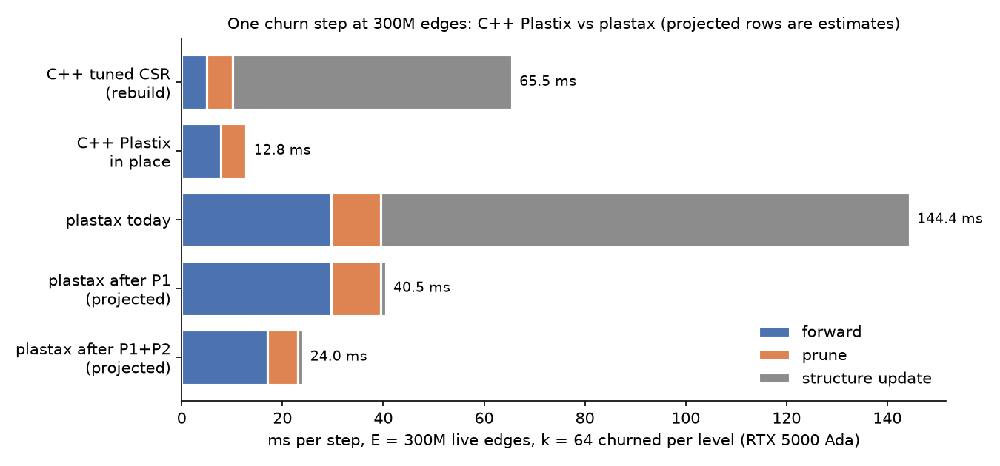

# plastax scale plan: in-place churn at O(churn), and a layout backend

2026-09-30 · Status: **in progress** on branch `scale` (worktree `../plastax-scale`). This plan ports the
plastix C++ improvements (in-place growth, radix resort, the correctness fixes)
to plastax, and assesses CSR and dense layouts in JAX as a multi-backend path.
All numbers were measured on cdol01 (RTX 5000 Ada, 32 GB) with jax 0.11.0 +
`jax[cuda13]`, plastax `a145691`, in a scratch venv. The probes are
`docs/scale_plan/plastax_probe.py` (synthetic churn net),
`jax_layouts_probe.py` (one layer per layout) and `rb2.py` (sort strategies);
they become committed benchmark scripts in P0.

## TL;DR

- **plastax already has the in-place design.** Tombstoned slots, per-level
  fixed-capacity buckets, and new edges written into free slots of their own
  level are the same mechanism the C++ `InPlaceGrowth` path added. What it
  lacks is *cost proportional to churn*: the growth phase does O(capacity)
  work, including a **full sort of every bucket, every step**.
- **Measured** at E = 300M, 64 edges churned per level per step:
  - plastax takes **144 ms/step**: forward 29.7, prune 9.8, growth 105.
  - C++ in-place takes 12.9 ms; tuned CSR with a rebuild takes 65.5 ms.
  - Growth is 73% of the plastax step, against 0.01 ms in C++.
- **Memory is plastax's strength.** 300M live edges take 7.0 GB of state,
  against 27 GB for C++ Plastix. That is about 23 B per live edge including
  power-of-two padding (13 B per slot), against 97 B per slot. plastax could
  plausibly reach about 1B edges on this card, where C++ stops at about 300M.
- **Feasible, without breaking an invariant** for the churn work (P0-P3). The
  projected step is about 40 ms at 300M after P1 and about 24 ms after P2.
  That would be 2.7× faster than a CSR rebuild and 1.9× slower than C++ in
  place.
- **CSR in JAX works, but only with a flag, and only pays off batched.**
  - `jax.experimental.sparse.BCSR` lowers to cuSPARSE only with
    `jax_bcoo_cusparse_lowering=True`. Without it, it is 30-80× slower than a
    plain `segment_sum`.
  - With it, CSR is 1.2× faster at batch B = 1, and **9.5× faster at B = 128**.
  - A CSR rebuild (radix sort) costs 19 ms at 25M edges, so CSR must be a
    cached, derived view, not the arena.
- **Dense only pays at ≥ ~10% density, and only fits small layers.** A 16K ×
  16K layer is 1.1 GB. A 158K × 158K layer would be 100 GB.
- **Three correctness issues** were found on the way (P0). One is a real
  bug: the growth phase's duplicate check overflows int32 once
  `num_units > 46,340`.

## 1. What the C++ work changed, and where plastax stands

| C++ change (plastix fork) | plastax today | Port? |
|---|---|---|
| In-place growth into same-level dead slots (`5e0aff2`) | Same mechanism (`build_add_conn_phase` prefix-sum slot claim) | Already there. Make it O(churn): **P1** |
| Headroom dead slots per level; resort only on overflow | `capacity_policy(headroom=)` exists but is rounded to a power of two. The driver grows the bucket and retraces on overflow | Fractional, non-power-of-two capacities: **P2** |
| Fused radix resort with a 32-bit key and level-bits cap (`281f05c`, `8f57838`, `3f1eb15`) | `topo.resort` does one cumsum-scatter plus one u32 `sort_key_val` per bucket, which is already CUB radix | Minor; resort is rare once growth is in place. Fold buckets into one keyed sort only if profiling says so |
| Key-width overflow fix (`3f1eb15`) | **Same bug class:** `from*num_units+to` in int32 in the add_conn duplicate check | **P0 bug fix** |
| Sampling salt: proposals must depend on the step (`3c24c83`) | The hash scores take `g["step"]` or a cursor; the policy is responsible | Audit, document, and test in P1's proposal API |
| Stale CUDA-graph fix (`RangesEpoch_`) | N/A: `NetworkStatic` is the jit key, and state is functional | none |
| Batched device forward (`3df28ae`) | One sample per step. COO `segment_sum` at B = 128 is 9.5× slower than CSR | Layout backend: **P5** |
| `--validate-every` host-replay check | Oracle tests exist; no "in place vs rebuilt" equivalence test | **P1 test gate** |

### Measured phase costs (ms/step, fwd = forward only; + adds one phase)

| E (live) | L per layer | slots | state | fwd | + prune | + growth | full step |
|---|---|---|---|---|---|---|---|
| 5.4M | 16,384 | 8.4M | 0.11 GB | 0.45 | +0.10 | +1.34 | 1.88 |
| 50M | 158,114 | 67M | 0.88 GB | 4.16 | +1.14 | +9.5 | 15.1 |
| 300M | 387,298 | 537M | 7.0 GB | 29.7 | +9.8 | +108 | 144 |

The C++ in-place step at the same sizes: 0.24, 2.19 and 12.9 ms. A shortlist
of M = 1024 instead of 64 at 50M changed the growth phase by less than 1 ms, so
the growth cost is the O(capacity) work, not the candidate grid.

### Where the growth time goes (`phases.py:680-888`, per bucket, per step)

1. **Duplicate check:** `jnp.sort(live_pair)` over the whole bucket capacity,
   then `searchsorted`. This sort *is* the 105 ms: it is the per-step rebuild the
   C++ work removed, reintroduced as a duplicate filter.
2. **Free-slot rank:** `cumsum(dead)` plus a capacity-sized scatter building
   `local_slot_for_rank`. This is O(capacity) and bandwidth-cheap, but still an
   extra pass.
3. **Candidate grid:** M × M per level (with a shortlist), or `num_units²`
   (without one). The plastax DeepR port (`15_deepr_multimnist/plastax/deepr.py`)
   has no shortlist, so it scores the full `num_units²` grid. At the C++ DeepR's
   4.4M hidden units that is about 2·10¹³ candidates, so today it cannot run
   beyond a few thousand units.

## 2. Correctness findings (P0)

1. **int32 pair-id overflow in the growth phase's duplicate check**
   (`phases.py`, `live_pair = from * num_units + to`, int32). Once
   `num_units > 46,340` the ids wrap. Distinct pairs then collide (a false
   "duplicate" drops a valid candidate), or a real duplicate is missed and a
   parallel edge is grown. Every probe here was in this regime (the smallest
   has 49,152 units). Fix: compare `(src, dst)` as a pair (two-key search) or pack the key
   into a per-bucket local id space. Add a regression test with `num_units`
   above 2¹⁶.
2. **The `indices_are_sorted=True` hint on the topological forward is
   violated.**
   - The hint is set in `phases.py:_build_forward_topological_phase`, but it
     only holds right after construction or a resort.
   - Prune tombstones in place, which redirects dead targets to `num_units` in
     the middle of the array. Growth writes into arbitrary dead slots.
   - Measured: about 1,300-1,500 descents per bucket after 20 churn steps. The
     output still matched an unsorted `segment_sum` to 2e-6 on GPU (XLA's
     scatter-add ignores the hint there).
   - It is still undefined by contract, and could silently break on CPU or TPU,
     or in a future XLA.
   - The hint also buys nothing: at 25M edges the unsorted `segment_sum` was
     *faster* (1.49 vs 1.73 ms).
   - Fix: pass `False`. If a sorted fast path is ever wanted, gate it on a
     static "freshly resorted" layout, never on a runtime property.
3. **Host sync every step.** `Driver.step` calls `bool(result.overflow)` and
   `bool(state.needs_resort)` on every step, which blocks dispatch.
   - Overflow drops candidates rather than corrupting state, and
     `needs_resort` is already sticky in state.
   - So both can be made sticky and checked every N steps, with N = 1 kept as
     the exact current behaviour.

## 3. Decisions (2026-09-30)

1. **CSR only, no dense view.** Invariant 8's densification exclusion stays.
   A custom **Pallas** kernel is in scope now, as the extension avenue beyond
   cuSPARSE.
2. **Duplicate edges are allowed.**
   - Proposal growth defaults to no duplicate check.
   - An opt-in exact per-step dedupe exists, and algorithm developers are told
     plainly (docstrings and user docs) that duplicates are possible.
   - Performant algorithms exclude duplicates by construction.
3. **Batched inputs are in v1**, documented as a convenience: the library stays
   primarily streaming, one sample per step.
4. **A `cuda13` extra** is added next to `cuda12`.

## 4. Plan

Every task ends with the fast suite green, `mypy --strict`, and the hooks
passing. A GPU number goes in the loop log when the task touches performance.
One scope per commit (SCOPES.md).

### P0: correctness and harness

- [x] 0.1 `build(packaging)`: add a `cuda13` extra and a `gpu13` alias, plus a
  TOOLING note.
- [x] 0.2 `fix(phases)`: fix the int32 pair-id overflow in the growth phase's
  duplicate check. Add a regression test with `num_units` above 2¹⁶ where
  wrapped ids collide.
- [x] 0.3 `fix(phases)`: drop the `indices_are_sorted=True` hint on the
  topological forward and backward. Add a test that churns and then compares
  the forward against an unsorted reference.
- [x] 0.4 `feat(examples)`: add `examples/benchmarks/` with the churn probe and
  the layout probe (GPU-only, not collected by pytest), plus a README on how to
  run them.

- [x] 0.5 `perf(phases)`: the wide duplicate check uses one uint64 radix sort
  under a scoped `jax.enable_x64` instead of two stable passes.

### P1: growth at O(churn)

Design (refined in iteration 1, from the C++ sampled path in
`dispatch_gpu.hpp:653` and `cuda_kernels.hpp:498`):

- **How C++ does it.** C++ `GrowFanout` draws k random partners per unit
  (O(N·k)). An accept predicate decides each one, and accepted proposals
  commit with no dedupe, since "duplicates are harmless parallel edges".
- **What plastax changes.** plastax generalises the *candidate source* and
  keeps everything downstream:
  - A policy declares a static `num_proposals` and
    `propose(u, j, g) -> (src, dst, score)` for `j in [0, num_proposals)`.
  - `score = -inf` vetoes, exactly as on the grid.
  - The framework vmaps `propose`, routes each proposal to the bucket of its
    source level, and applies the level window.
  - It then optionally dedupes, and runs the same per-bucket
    `top_k(max_candidates)`, free-slot claim and `init` as the grid path.
- **Proposal granularity is the policy's choice.**
  - `num_proposals = num_units * fanout` with `j // fanout` as the unit gives
    C++ `GrowFanout`.
  - `num_proposals = k` gives direct uniform sampling.
- **Dedupe.** `dedupe: bool`, default True on the grid path (today's
  behaviour) and False on the propose path.
  - `dedupe=True` on the propose path checks against the live edges
    (`live_pair_member`, O(capacity log capacity)).
  - It also drops repeats within the step's own top-k (O(k log k)); the grid
    never has these.
- **Free-slot claim.**
  - Today the first-k free slots come from a capacity-sized scatter (the
    `local_slot_for_rank` array).
  - They will instead come from
    `searchsorted(cumsum(dead), arange(1, k + 1))`: an O(capacity) scan plus
    O(k log capacity), with no capacity-sized write.
  - The grid path benefits too.

- [x] 1.1 `perf(phases)`: free-slot claim via `searchsorted` on
  `cumsum(dead)`. Keep it Scheme-A-aware, and keep existing tests green.
- [x] 1.2 `feat(traits)`: the `ProposeAddConn` protocol (`num_proposals`,
  `propose`) and the `dedupe` attribute.
  - Validation: a policy defines either `score` (grid) or `propose`.
  - Docstrings state the multigraph semantics and the step-dependent seeding
    requirement (the C++ salt lesson).
- [x] 1.3 `feat(phases)`: the propose path, with routing, window, optional
  dedupe (live plus within-step), top-k, claim and init. Scheme-A: proposals
  are replicated, as the grid is.
- [x] 1.4 `test(phases)`: equivalence test in the spirit of the C++
  `--validate-every`.
  - Run N in-place churn steps, then rebuild with `from_edges` from the live
    multiset.
  - Assert the same live multiset and the same forward output. Cover
    overflow → grow and resort.
- [ ] 1.5 Bench, outside this repo: switch the DeepR plastax port to
  `propose`, run it on the real MultiMNIST stream, and scale to the memory
  bound.

- [x] 1.6 `perf(builder)` / `perf(topo)` (found in iteration 2): source-major
  bucket layout. The forward at 50M dropped from 4.83 to 1.47 ms on GPU, and
  forward+backward is 1.4× faster on CPU.

### P2: capacity and forward bandwidth

- [x] 2.1 `feat(topo)` (landed as `feat(api)` 9550d59): `capacity_policy(..., align=)` with no power-of-two
  rounding (alignment keeps Scheme-A divisibility). Thread it through
  `from_edges` / `grow_bucket` / `resort`.
- [ ] 2.2 Profile the edge-list forward with nsys: materialisation of the
  vmapped `map` output, and gather/scatter fusion. Fix what is fixable in XLA.
  (Partly superseded: the source-major layout already brought the forward to
  9.7 ms at 300M, against 7.7 ms for C++.)
- [x] 2.4 `perf(phases)`: a two-level free-slot search (e901255; growth
  went from +4.7 to +1.0 ms at 300M).
  - Use a per-block dead count (a reduction reading 1 B per slot), a cumsum
    over the blocks, and a within-block search for the k claimed ranks.
  - This replaces the full `cumsum(dead)`, which writes 4 B per slot. It is
    most of the 8 ms add phase at 300M.
- [x] 2.5 (no change needed) Prune is at the DRAM roofline: 6.0 ms at 300M
  with aligned capacities, reading about 10 B per slot. The rest of this item
  is superseded. Prune costs 10.2 ms at 300M, against 5.1 ms for C++.
  Check whether the predicate's vmap plus the `dead | should_die` write fuse
  into a single pass.
- [x] 2.6 (in 9550d59) resort sizes capacities with `headroom=0`, which leaves
  every bucket nearly full after a resort (seen in the equivalence test).
  Thread the headroom through, so a resort is not followed by an
  overflow → grow → retrace.
- [ ] 2.3 Find the largest E that fits on 32 GB. **Blocked by host memory,
  not GPU memory.**
  - At 600M edges, `from_edges` (host numpy: levels, then a per-bucket
    lexsort with int64 indices) took host RAM from about 57 GB free to about
    1 GB in under a second. It crashed the session twice.
  - Do not retry until 2.7 lands. 300M is the tested ceiling on cdol01.
- [ ] 2.7 `perf(builder)`: a lower-memory build.
  - Use int32 indices, and one argsort per bucket over a packed key instead of
    `lexsort` plus fancy-index copies.
  - Levels via device `recompute_levels`, or a chunked host pass.
  - Target: under 20 B of host RAM per edge.

### P3: driver without per-step sync

- [x] 3.1 `feat(driver)`: add `Driver(check_every=N)` (8260c4f). This landed
  without a state change: overflow is OR-accumulated on device by the Driver.
  - Measured: 0.515 → 0.406 ms per step at 100K edges, and 0.697 → 0.547 ms
    at 5.4M, with N = 16.
- [x] 3.2 (explored, not adopted) A `lax.scan` over T steps in one jit. Past
  `check_every` it gains only 0.406 → 0.338 ms at 100K edges and nothing at
  5.4M, so the floor is device work, not Python dispatch.
- [x] 3.3 `perf(phases)` (407ccb1): unrolled `searchsorted`. The default
  method is a while loop, one kernel launch per halving.
  - The add phase at 5.4M went 0.34 → 0.07 ms.
  - Overflow becomes sticky in state (a design check first: adding a
    `NetworkState` field is a pytree change).
  - Check every N steps; the default N = 1 is unchanged behaviour.

### P4: batched inputs

Design (drafted in iteration 3):

- **Shape.**
  - `StepInputs.inputs` is `(B, num_inputs)` and `targets` is
    `(B, num_outputs)`.
  - A static `batch_size` in `NetworkStatic` (a jit key) allocates unit
    columns as `(B, num_units)`, so per-sample unit state persists like
    streaming state does.
  - Connections and globals are unbatched.
- **Forward, loss, backward.** The existing phase functions are `jax.vmap`ped
  over the unit axis, with connections and globals broadcast. They write no
  connections, so `out_axes=None` holds for them.
  - The COO forward then materialises an (E, B) intermediate. At B ≥ 32 the
    CSR view (P5) takes over; at small B, the edge-once Pallas kernel (P6).
- **Connection updates: the hard part.** One update per step must see the
  batch.
  - The default reduction is the **mean of the per-sample writes**. It is exact
    for rules linear in the per-sample term: SGD, momentum, plain delta rules.
  - It is **not** exact for Adam or RMSprop, because `mean(g²) ≠ mean(g)²`
    inside v.
  - Exact path: an optional structural pair on `UpdateConn`:
    - `per_sample(u, dst, src, c, cid, g) -> pytree`, which the framework
      vmaps over B and averages (typically the gradient `grad_pre_act[dst] ·
      act[src]`);
    - `incoming_batched(u_mean, dst, src, c, cid, g, stat) -> ConnWrite`,
      which applies the optimizer once to the averaged statistic.
  - The `optim/` bundles implement the pair, so SGD, momentum, Adam, AdamW and
    RMSprop are exact batched. They are tested against optax on averaged
    gradients.
  - A user rule without the pair gets the mean-of-writes default, and the
    docstrings say where that is exact.
- **Prune and add.** They see the batch-mean unit view, so importance and
  scores use mean activity.
- **Docs.** State plainly that the library is primarily streaming (B = 1),
  and that batching is a convenience for evaluation and mini-batch training.

- [x] 4.1 Design note (above). As built, unit columns stay `(num_units,)`
  and hold the batch mean, so no batched unit state is persisted.
  - Batched `StepInputs` of shape `(B, num_inputs)`, and unit columns of shape
    `(B, num_units)` during forward and backward only.
  - Connection updates reduce over B. Pinning this down (is it the mean of
    per-sample deltas, or something else?) is the hard part, since optimizer
    state must see one update per step.
  - Decide the API: `make_step(..., batch=B)` or a separate
    `make_batched_step`.
- [x] 4.2 Built: 997480a (optim pair), 347e655 (`make_step(batch_size=)`),
  edd86e2 (Scheme-A check).
- [x] 4.3 Tests: B = 1 equals streaming; SGD batched equals the mean of
  per-sample steps; all five optim bundles match optax on the batch-mean loss.

### P5: CSR layout view (cuSPARSE)

- [ ] 5.1 Design note. Refined in iteration 5:
  - **Scope.** Only *linear* passes take the view. A `ForwardPass` or
    `BackwardPass` declares, structurally, `linear_input: FieldSpec`: its map
    is `WEIGHT · u[linear_input, other]` and its combine is `sum`. Its `apply`
    stays arbitrary and per-unit. `mlp_xor`'s sigmoid passes and the optim
    MLPs all qualify.
  - **Forward.** A destination-major CSR over the live edges: `perm`
    (arena slot per CSR position), `indptr (num_units + 1)` and `indices`.
    The values are `weight[perm]`, gathered per step, so the weights stay in
    the arena.
  - **Backward.** It reduces into sources. The arena is already
    source-major after a build or resort, so the transpose view is the same
    construction keyed on `from_id`.
  - **Freshness.** The view is rebuilt on device in the jitted step, with one
    radix sort, whenever structure changed since the last rebuild (tracked by
    a step counter in state), or every R steps with a COO delta between.
    First cut: rebuild on any structural change. Batched training on a
    static structure is the case that pays.
  - **Selection.** A trait `Network.layout = "edge_list" | "csr"`. With
    "csr" the view columns live in the state (static shapes: capacity +
    `num_units + 1`).
- [ ] 5.1b Measure first: cuSPARSE SpMM through `jax.experimental.sparse`
  inside a vmapped per-sample phase does not apply directly. The batched
  forward must call `BCSR @ X` with the batch as columns, which means
  restructuring the per-sample vmap for linear passes.
  - Only for a built-in `LinearForward`/`LinearBackward`.
  - The view is `perm/indices/indptr` plus the values `weight[perm]`
    (tombstones give 0), plus a COO delta for edges grown since the last
    rebuild, plus a rebuild every R steps or on delta overflow.
- [ ] 5.2 Build the forward (cuSPARSE `csrmv`/`csrmm` via
  `jax.experimental.sparse`, with the lowering flag scoped to the call).
- [ ] 5.3 Backward: the transpose via cuSPARSE, or a CSC view.
- [ ] 5.4 Tests against the edge-list path; benchmark at B = 1 and B = 128.

### P6: Pallas kernel (extension avenue)

- [ ] 6.1 Spike: a Pallas GPU (Triton) kernel for the edge-list forward.
  - The user's per-edge `map` is traced inside the kernel, combined with a
    named monoid via atomics, over one bucket.
  - Measure it against XLA `segment_sum`.
- [ ] 6.2 If it wins: an edge-once batched variant (each edge read once, all B
  samples).
- [ ] 6.3 Place it as an opt-in backend next to CSR.

### P7: parity and write-up

- [ ] 7.1 A plastax implementation in `plastix-synth-bench`, rerun at 5.4M,
  50M and 300M, with plastax rows added to the figures.
- [ ] 7.2 Results Markdown with PNG figures. Keep this plan's log current.

## 5. Autonomous loop protocol

Each iteration runs four discrete steps, in order, and appends one entry to
the log below:

1. **Build:** take the next unchecked task, implement it, add tests, run the
   hooks' checks, and commit.
2. **Document:** update docstrings, docs and plan text touched by the build;
   remove stale comments; commit separately (`docs(scope)`).
3. **Explore:** run a GPU experiment tied to the phase (a measurement, a spike,
   or an idea test). Record the number and what it implies.
4. **Plan:** tick the boxes, re-order or add tasks from what was learned, and
   put anything the user should weigh under "Surfaced for review".

## 6. Surfaced for review

- **plastax now roughly matches the hand-written C++ in-place path** (within
  6-10% from 5.4M to 300M edges) at 6.6× less GPU memory. It is 4.8× faster
  than the tuned CSR rebuild at 300M.
  - For the paper this changes the story: the JAX library is the practical
    vehicle, not only the reference.
  - The C++ remains ahead only by constant factors: prune reads fewer bytes,
    and growth is free of kernel launches.

- **Bucket layout changed from destination-sorted to source-major**
  (`d720ece`).
  - It gives 1.7-3.3× on the GPU forward and 1.4× on CPU. Results change only
    in floating-point summation order.
  - A hash-shuffled layout is fastest on GPU for training (fwd+bwd), but 2×
    slower on CPU. A per-backend layout choice is possible later, and moot
    once the CSR and Pallas backends exist.
- **The Driver's overflow retry replays the whole step** (forward, update,
  prune) on the already-stepped state. This is documented in `Driver.step`.
  For stateful rules (a decaying update, a Langevin step) it applies them
  twice. P3 (sticky overflow, drop the growth instead of retrying) would
  remove this.

- **Exact dedupe on the grid path now costs about 2.5× more past 46,340
  units** (+24 ms at 50M, against +9.5 ms for the old check that silently
  wrapped). That is the price of correctness. Grid-path users at that scale
  should move to `propose` once P1 lands.

- **plastax's host build is the scale limit on this box.**
  - At 600M edges, `NetworkBuilder.from_edges` needs more than 60 GB of host
    RAM, over 100 B per edge. The session crashed twice trying it, so it is
    not retried (P2.7 first).
  - The device state itself would have been about 14 GB.
- **Memory headroom beyond C++.** plastax holds 300M edges in 7.0 GB, against
  27 GB for C++ Plastix. The C++ side's 97 B per slot is mostly scratch
  (radix buffers, keys, perm) kept resident. It could probably be cut to about
  30 B, which would let C++ reach about 1B edges too.
- **Correction: the huge failed allocations were a bug, not autotuner noise.**
  The 9 GiB / 838 GiB / 4.91 TiB allocation errors at 5.4M, 50M and 300M
  edges were exactly 4·N² bytes: the add_conn builder eagerly materialised
  the num_units² candidate grid for *every* policy.
  - The allocation failed asynchronously, and the proposal and shortlist
    paths never read the array, so the runs completed. The numbers are
    unaffected.
  - At smaller sizes where the grid *fits*, it silently held 8·N² bytes of
    device memory.
  - The plastax-review pass found it; it is fixed in iteration 3.
- **`jax.experimental.sparse` needs `jax_bcoo_cusparse_lowering`** to use
  cuSPARSE at all. Any user-level BCSR comparison without the flag is
  30-80× pessimistic.

## 7. Loop log

(Entries are appended per iteration, newest last.)

### Iteration 1 (2026-09-30): P0

- **Build:** P0.1-P0.4 committed: `bef72e4` (cuda13 extra), `8abf3a5`
  (pair-id overflow), `2003ff5` (sorted hint), `8d0a839` (probes). The fast
  suite went from 268 to 271 tests.
- **Document:** `cee4dd0`, `5eff59e`, `e09ec35`: the resort-order docstring,
  the architecture note, and the Deviations entry.
- **Explore.** The exact wide-id check was correct but slow: +57 ms per step
  at 50M edges, against +9.5 ms for the old, wrapping int32 check.
  - A uint64 pair id under a scoped `jax.enable_x64(True)` gives one radix
    sort, at 11 ms per 33M-slot bucket against 29 ms for two passes.
  - Committed as `8e9a2fb`: the add phase is now +24 ms at 50M (churn step
    30.2 ms).
  - None of the existing examples or bench defaults exceed 46,340 units
    (CIFAR is about 4.1K), so past results are unaffected by the bug.
- **Plan.** P1 was refined into the propose-source design above. It mirrors
  C++ `GrowFanout` (per-unit fan-out sampling, commit without dedupe).

### Iteration 2 (2026-09-30): P1

- **Build:**
  - `07eb1eb`: free-slot claim by binary search (-1.3 ms at 50M).
  - `b2eb326`: `ProposeAddConn`, with the protocol, the phase path, 5 propose
    tests, and the Driver equivalence test.
  - The equivalence test runs through overflow → `grow_bucket` and resort, and
    matches a network rebuilt from the live multiset, parallel edges included.
  - The fast suite now has 277 tests.
- **Document:** `f4982a9`, `cd4ad3e`, `b123eb0`, `9df71a6`.
  - Covers the agent docs, the scaffold template, the review checklist, the
    Deviations entries, and the `__all__` count, which is now 40 (it was
    already stale at 33).
- **Explore.**
  - At 50M, proposal growth costs +1.2 ms against +22.7 ms for grid growth.
  - Found a forward regression from P0.3: a destination-sorted bucket without
    the hint serialises scatter-add atomics (4.83 ms against 3.96 ms with the
    hint).
  - Measured bucket orders at 50M:
    - source-major: 1.47 ms fwd, 3.26 ms fwd+bwd (CPU fwd+bwd 9.2 ms);
    - hash-shuffled: 1.72 / 2.53 ms (CPU 24.4 ms);
    - destination-sorted: 4.83 / 5.67 ms (CPU 12.8 ms).
  - Committed source-major as `d720ece` / `9e6fbea`.
  - **300M churn step: 144 → 27.9 ms** (forward 9.7, prune 10.2, growth 8.0).
    C++ in place is 12.9 ms; tuned CSR is 65.5 ms. **50M: 4.0 ms**, against
    2.19 ms for C++.
- **Plan.**
  - Added P2.4 (two-level free-slot search), P2.5 (prune fusion) and P2.6
    (headroom through resort).
  - P1.5 (DeepR port) remains, because it lives in the bench repo.
  - Ran a `plastax-review` pass over the branch.

### Iteration 3 (2026-09-30): review fixes, P2, and the P6 spike

- **Review** (`plastax-review` agent; 1 high, 2 medium, 3 low, 2 nits, all
  fixed):
  - The **high** finding: the eager num_units² grid, fixed in d5bc16b. It also
    explains the "autotuner" allocation errors.
  - Within-step repeats consuming top-k slots.
  - Stale comments.
  - Missing PIPELINE and Scheme-A proposal tests (8570cf3).
  - `num_proposals` validation (ca0c74e, d98f626).
  - Doc drift.
- **Build:**
  - 9550d59: aligned capacities, with one sizing policy recorded in
    `NetworkStatic`.
  - e901255: the two-level free-slot search.
  - e097eb2: the lean probe generator.
  - The fast suite now has 289 tests.
- **Document:** a49d0f9, 49ef383 (the glossary and the Deviations entries).
- **Explore:**
  - 600M edges crashed the session twice through host RAM (P2.7); it is not
    retried.
  - 300M with `--align 256`: the state is 4.10 GB and the churn step went
    18.3 → **14.0 ms** after P2.4.
    - Forward 7.59 ms (C++ 7.69).
    - Prune 6.0 ms, at roofline.
    - Growth +1.0 ms (C++ 0.01).
  - 50M: 3.37 ms before P2.4.
  - The P6 Pallas spike is described below.
- **Plan:** P2 is done except 2.7 (host build memory). The next order is P3
  (driver, small) → P4 (batching) → P5 (CSR view) → P6 (Pallas) → P2.7 →
  P1.5 / P7 (DeepR and synth-bench parity).

- **Explore (P6.1 spike, `.bench/pallas_spike.py`, `.bench/pallas_batched.py`).**
  - A Pallas-on-Triton edge-list forward (gather `act[src]`, multiply by the
    weight, `atomic_add` into `out[dst]`, with the null slot for dead edges)
    runs correctly on jax 0.11.2 and cuda13, to 1e-5 against `segment_sum`.
  - **At B = 1 it is 3× slower than XLA** at 25M edges: 1.72 against 0.58 ms.
    XLA is at the DRAM roofline (about 12 B per edge at about 520 GB/s; the
    `act` gathers hit L2). Block size (256 to 16K) and `num_warps` (2 to 16)
    do not move it.
  - The likely cause is that `plt.atomic_add` exposes no memory order, so
    Triton emits acquire-release atomics where XLA's scatter uses relaxed
    reductions.
  - **Edge-once batched, at 10M edges:**
    - B = 8: 0.053 ms per sample against 0.149 for XLA (**2.8×**);
    - B = 32: 0.093 against 0.103, where the E·B atomics dominate.
  - cuSPARSE CSR at B = 128 was 0.054 ms per sample at 25M.
  - **Takeaway:**
    - Pallas pays for small batches, and for fusing arbitrary `map`
      functions, which cuSPARSE cannot do.
    - CSR/cuSPARSE pays for large batches of linear passes.
    - Plain XLA is already optimal for the streaming B = 1 linear case.
  - Next Pallas steps:
    - aggregate same-destination atomics within a block (destination-sorted
      tiles, as C++ `WarpAtomicAddKeyed` does);
    - try the Mosaic GPU backend for relaxed atomics.

### Iteration 4 (2026-09-30): P3 and the small-net floor

- **Build:** 8260c4f (`Driver(check_every=N)`), 407ccb1 (unrolled searches).
  The fast suite now has 291 tests, and the Scheme-A churn check passes.
- **Explore:**
  - A scan over steps was not worth adopting (see 3.2).
  - Found the while-loop `searchsorted` launch cost.
  - **The churn step is now within 6-10% of C++ Plastix in place at every
    size:**

    | edges | plastax | C++ in place |
    |---|---|---|
    | 5.4M | 0.259 ms | 0.24 ms |
    | 50M | 2.42 ms | 2.19 ms |
    | 300M | 13.7 ms | 12.9 ms |

  - GPU memory is 4.1 GB against 27 GB at 300M.
  - Forward and prune are at the DRAM roofline.
- **Plan:** next is P4 (batched inputs), with the design drafted above.

### Iteration 5 (2026-09-30): P4, batched inputs

- **Build:** 997480a, 347e655, edd86e2. There are 297 fast tests and 15 slow
  (all optimizers match optax batched).
- **Document:** 155e675 (README: streaming-first), 8e27272, 5bf06a3.
- **Explore:**
  - A batched training step (SGD, 3 layers, 5.4M edges) costs 0.537 ms per
    sample at B = 1, 0.347 at 8, 0.295 at 32, and 0.252 at 128. That is only
    2.1×, because the edge list touches every edge once per sample.
  - Fusing the batch mean (`vmap` + `mean`) instead of a `fori_loop` was
    worse at large B (38.9 against 32.3 ms at B = 128), because XLA
    materialises E×B. Reverted.
  - For comparison, cuSPARSE CSR at B = 128 measured 9.5× over COO for a
    single layer (iteration 1). **That is P5's case.**
- **Plan:** P5 refined above. The key design step is routing linear passes to
  one batched SpMM instead of a per-sample vmap.

## Deviations

(none yet)
