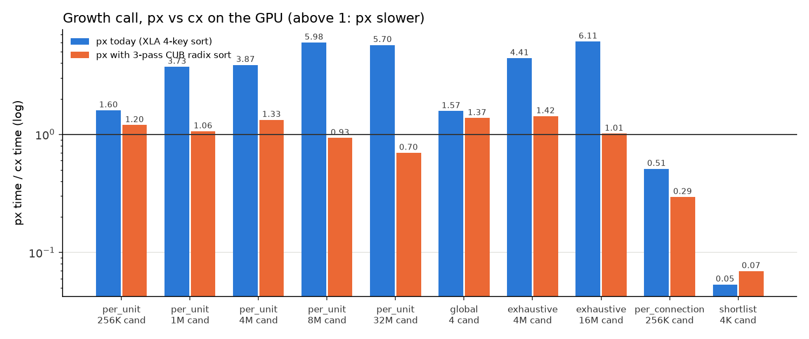
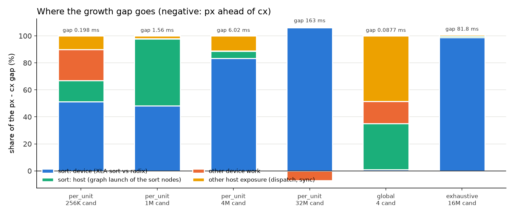
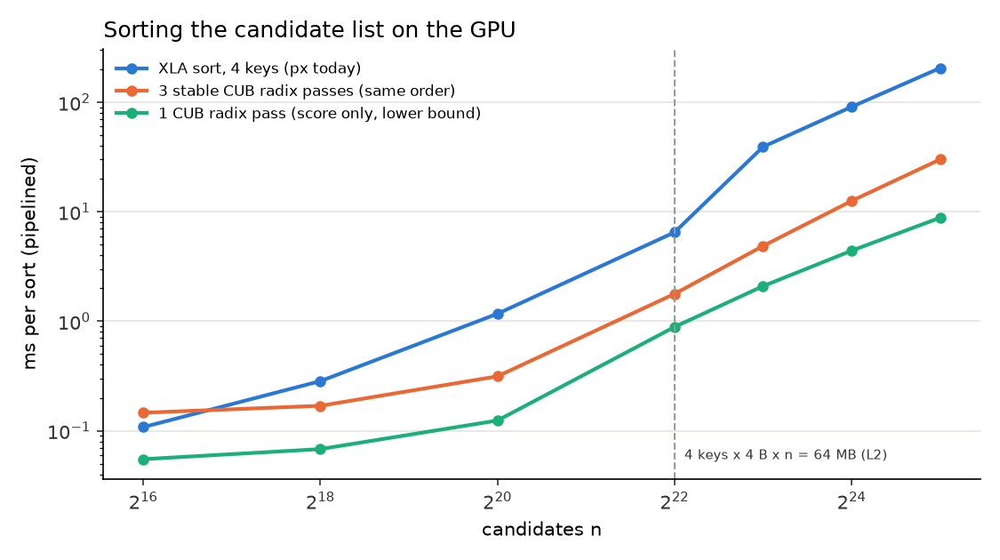
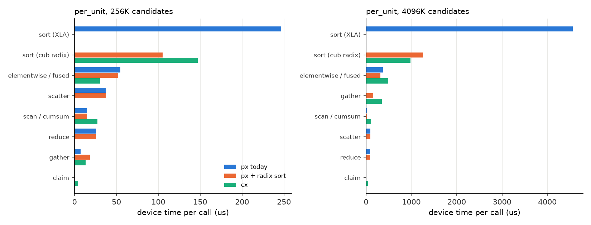
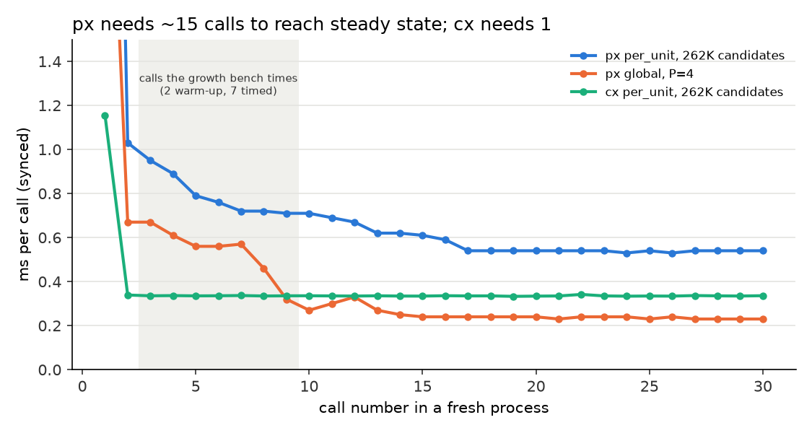
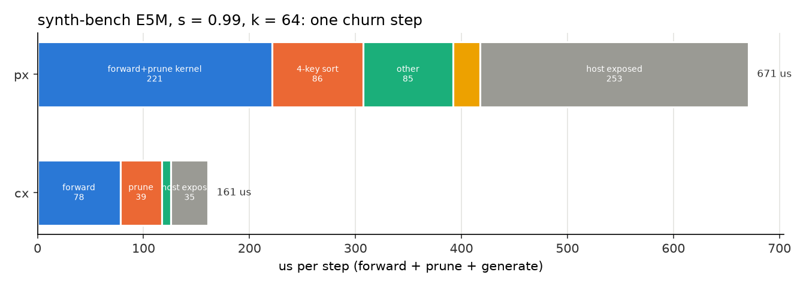

# Where the px vs cx GPU gap comes from

This note explains where plastax (px, JAX) loses time against plastax-cpp
(cx, C++/CUDA) on the GPU. It covers the growth call (`growth.md`) and the
one full-step comparison that exists, the plastix-synth-bench churn step. The
work is analysis: every fix below is a suggestion, and nothing in `src/` was
changed. The one code change measured, a different sort in `total_order`, was
monkeypatched into a probe script.

## Headline

- **The growth gap is mostly one HLO op.** px sorts the candidate list with
  one 4-key `lax.sort` (`total_order`: -score, src, dst, index). XLA cannot
  send a multi-key comparator sort to CUB. It runs its own sort emitter
  instead: one tile kernel `sort_21_1` plus 35 merge kernels `sort_21_1__1`
  to `sort_21_1__35` at 262K candidates (an O(n log^2 n) bitonic network).
  cx runs three stable 32-bit CUB radix passes, then a 16-bit level pass.
- **Swapping in three stable one-key sorts (dst, then src, then -score)
  gives the same total order and lets XLA use CUB onesweep.** The committed
  edges are identical at every point (same `grown` and column digest). The
  swap removes 67 % of the gap at the per-unit floor (262K candidates), 89 to
  98 % at 1M to 4M, and all of it past the L2 cliff. At 32M candidates px
  then beats cx: 24.1 ms against 34.6 ms.
- **Host dispatch is a smaller cause than it looked.**
  - Timing px with `perf_counter` against cx with CUDA events costs cx about
    5 us. cx's event window already contains its own host round trips: about
    125 us of GPU idle per call, from 3 `cudaDeviceSynchronize`, 7 blocking
    `cudaMemcpy` and 4 blocking `cudaMemset`.
  - px's exposed host time is 0.10 to 0.13 ms at the floor. That is only
    0.02 to 0.04 ms more than cx's.
- **The published px GPU floor is inflated by warm-up.** px needs about 15
  calls in a fresh process to reach steady state; cx needs one. The growth
  bench times calls 3 to 9, so px per_unit at 262K candidates reads
  0.83 to 0.91 ms there, against a steady state of 0.53 ms.
- **The full step (synth-bench E5M, s = 0.99)** takes 0.672 ms in px against
  0.161 ms in cx (4.2x). The gap of 0.51 ms splits as follows:
  - 43 % host exposure (graph launch and sync);
  - 32 % growth device work, half of it the same 4-key sort, here over 21K
    candidates;
  - 20 % a slower fused forward + prune kernel;
  - 5 % device-to-device copies around the Triton custom calls.

The gap per growth point, split by cause (steady state, locked clocks):

| point | px | cx | ratio | sort, device | sort, host | other device | other host |
|---|---|---|---|---|---|---|---|
| per_unit N=65536, P=4 (262K) | 0.529 | 0.331 | 1.60 | 51 % | 16 % | 23 % | 10 % |
| per_unit N=2^18, P=4 (1M) | 2.12 | 0.569 | 3.73 | 48 % | 50 % | 0 % | 2 % |
| per_unit N=2^20, P=4 (4M) | 8.12 | 2.10 | 3.87 | 83 % | 5 % | 0 % | 11 % |
| per_unit N=2^20, P=32 (32M) | 197 | 34.6 | 5.70 | 106 % | 0 % | -7 % | 1 % |
| global P=4 | 0.241 | 0.153 | 1.57 | 1 % | 34 % | 16 % | 49 % |
| exhaustive N=4096 (16M) | 97.8 | 16.0 | 6.11 | 99 % | 1 % | -1 % | 1 % |

Times are in ms; the shares are shares of px - cx. "Sort, host" is the extra
host time the larger CUDA graph costs (see the section on host time). A
negative share means px is ahead on that part.

## Method

- **Hardware and clocks.** RTX 5000 Ada, with clocks locked at SM
  2505 / memory 8551 MHz (reset on exit). No other GPU process was running
  in any timed run.
- **Software.**
  - px: `origin/main` at `fe8db8b` with `jax[cuda13]` 0.11.0 (the frozen
    lock), XLA's claim engine, and
    `XLA_FLAGS=--xla_disable_hlo_passes=constant_folding`.
  - cx: `main` at `68edb3b`, built Release for sm_89 with `-lineinfo`.
- **cx bench_growth.** Built from a scratch copy patched with a single-point
  filter (`GAP_POINT`), an NVTX range around each call, and a wall-clock
  print next to the CUDA-event time. The timing code was not otherwise
  changed.
- **px probe.** `examples/benchmarks/gpu_gap_probe.py` builds the same point
  as `growth_bench.py` and runs 30 warm-up calls. It then reports three
  times: synced (the bench's method), dispatch-only, and pipelined (50 calls
  back to back with one sync, which is the device time with dispatch
  overlapped). `GAP_SORT=lsd3` swaps in the 3-pass sort.
- **Profiles.**
  - `nsys profile -t cuda,nvtx,osrt`, with `--cuda-graph-trace=node` for
    px, because XLA runs the phase as one CUDA graph.
  - `examples/benchmarks/gpu_gap_nsys.py` reduces each NVTX range to: wall
    time, device busy time (the union of kernels, memcpys and memsets), lead
    and tail host time, idle gaps, op counts and time per kernel class.
  - nsys adds host overhead, so totals come from the unprofiled runs, and
    nsys supplies only the device-side splits and the counts.
- **Decomposition.**
  - Device time is px's pipelined time and cx's nsys busy time. Host
    exposure is synced (px) or event (cx) time minus device time.
  - The sort share is the measured A/B difference between the 4-key sort and
    the 3-pass sort, split into its device and host parts.
  - The four parts sum exactly to px - cx.
- **Ranges.**
  - The probe numbers vary from run to run at 1M candidates with the 4-key
    sort: synced is 1.7 to 2.1 ms around a steady pipelined 1.24 ms (host
    jitter in the graph launch).
  - Near the L2 cliff (4M) the standalone probe and the in-bench run differ
    by about 20 %: 8.1 against 6.3 ms.





## Cause 1: XLA's multi-key sort (most of the growth gap)

- **What runs.** The optimized HLO of the per-unit phase has one
  `%sort.21.1 = (f32[262144], s32[262144], s32[262144], s32[262144])
  sort(...)` with the 4-operand comparator `%region_0.7`. XLA's GPU sort
  rewriter sends only one-key sorts (keys, plus one optional value) to
  `cub::DeviceRadixSort`. Everything else uses XLA's own sort kernels.
  - At 262K candidates that is 36 launches: 53 us for the tile sort, 7
    global merges of about 12 us each, and 28 shared-memory merges of about
    4 us each. That adds up to 247 us of device time, against 147 us for cx's
    radix passes.
  - The kernel count grows with log^2 n: 78 sort kernels at 4M and 120 at
    32M.
  - There are also 3 `kCopy` thunks of the sort operands, because the sort
    runs in place over its operands.
- **Scaling.** XLA's sort moves 16 B per candidate per pass. At 4M
  candidates the 4 operands fill the 64 MB L2 exactly, so every global merge
  past that point goes to DRAM. This is px's L2 cliff: 6.5 ms for the sort
  alone at 4M, 39 ms at 8M. cx's cliff sits at the same 4M to 8M, but its
  radix passes are linear, so its cliff is gentler.
- **Fix as measured.** Three stable one-key sorts (`lsd3_total_order` in the
  probe) give the same order:
  - stability preserves the earlier keys, and the candidate index is
    implicit;
  - NaN maps to +inf as before;
  - -0.0 is canonicalized to +0.0, because the comparator treats them as
    equal and a radix sort would not.

  The digests match at every point, and a direct permutation check on lists
  with heavy ties, NaN, -inf and +/-0 matches exactly.

| candidates | XLA 4-key sort | 3 CUB passes | 1 CUB pass (lower bound) |
|---|---|---|---|
| 64K | 0.108 | 0.146 | 0.055 |
| 262K | 0.284 | 0.169 | 0.068 |
| 1M | 1.17 | 0.314 | 0.124 |
| 4M | 6.49 | 1.78 | 0.887 |
| 8M | 39.2 | 4.87 | 2.09 |
| 16M | 90.8 | 12.6 | 4.41 |
| 32M | 205 | 30.1 | 8.82 |

All times are in ms per sort, from the isolated microbenchmark (pipelined,
locked clocks).



- **Crossover.** Below about 128K candidates, XLA's sort beats three CUB
  launches. The shortlist point (4K candidates) gets slower with the swap:
  0.32 to 0.41 ms. So the fix should branch on the static candidate count.
- **CPU.** The swap would hurt the CPU. XLA:CPU sorts with a comparator even
  for one key, and three passes take 1.8x as long as one 4-key sort (208
  against 113 ms at 262K). The CPU gap needs a different fix (see the
  candidate fixes).



## Cause 2: host time

- **px.** The whole phase is one XLA command buffer (a CUDA graph of 123
  kernel nodes plus memcpy nodes at 262K candidates). On every call the
  runtime does three things:
  - it updates 6 to 9 kernel nodes and 4 memcpy nodes
    (`cuGraphExecKernelNodeSetParams`, `cuGraphExecMemcpyNodeSetParams`),
    because the donated buffers change address between calls;
  - it calls `cuGraphLaunch`, which blocks before the first kernel starts;
  - it calls `cuLaunchHostFunc` to signal completion.

  Under nsys, `cuGraphLaunch` takes 175 us per call at 262K, 572 us at 4M and
  1.8 ms at 32M with the 4-key sort, against 123, 176 and 350 us with the
  radix sort. That is the "sort, host" column: the bitonic network makes the
  graph larger and its launch slower.
- **px unprofiled.** Synced minus pipelined is 0.10 ms (global, radix sort)
  to 0.13 ms (per_unit 262K, 4-key sort) at the floor, and up to 0.9 ms at
  1M with the 4-key sort.
- **Command buffers help.** Turning them off
  (`--xla_gpu_enable_command_buffer=`) makes every floor point slower, by
  0.04 to 0.12 ms synced, so the graph is not the problem; its size is.
- **cx.** It launches 53 kernels, 26 memsets (4 of them blocking
  `cudaMemset`) and 7 blocking `cudaMemcpy` (device-to-host counts), with 3
  `cudaDeviceSynchronize`. That leaves 125 to 133 us of idle GPU per call at
  every size, which is 37 % of the 262K call and over half of the global P=4
  call. cx's CUDA-event window spans all of it, so events against
  `perf_counter` hides almost nothing: 0.304 ms event against 0.308 ms wall.
- **Warm-up.** px reaches steady state only after about 15 calls, and does so
  with command buffers on or off, so the cause is on the host. The growth
  bench's 2 warm-up + 7 timed calls land on the slope.



## Cause 3: other device work

With the radix sort in place, px's device time at the floor is 0.297 ms
against cx's 0.252 ms busy time (+45 us). This is launch count, not
bandwidth: px runs 108 kernels per call against cx's 53, most of them 1 to
2 us. Two sources account for nearly all of it:

- **XLA slot claim: about 20 tiny kernels per bucket.**
  - Each bucket runs block counts, a `reduce_window` cumsum, a search, and
    then one `input_scatter_fusion_*` per column (grid 1 x 32 threads,
    1.3 to 1.8 us each).
  - The Triton claim (`growth="triton"`) cuts the device time at 262K from
    0.296 to 0.252 ms, the same as cx. But it raises dispatch, so synced
    time does not move (0.408 against 0.419 ms).
- **`select_per_segment` runs one full-length pass per segment.** For each
  of the 4 source levels it runs a cumsum over the whole sorted list and a
  scatter (`loop_reduce_window_fusion_2`, `loop_add_fusion_2`,
  `input_scatter_fusion_9`). That is about 30 us at 262K, growing with n.

Donation works: all 22 state leaves alias input to output
(`input_output_alias`), and there are no transposes. Besides the sort-operand
copies, each bucket's `DEAD` mask is copied twice (`copy.22` -> `copy.4`,
`copy.26` -> `copy.8`), which is small (12 memcpy nodes, about 12 us).

At large n, px's non-sort device work is lighter than cx's. cx gathers its
three arrays after every radix pass: 7.1 ms of gathers and 8.0 ms of
elementwise kernels at 32M, against 2.8 and 2.4 ms in px.

## The full step: synth-bench E5M

- **What exists.** The only px vs cx full-step comparison on this GPU is
  plastix-synth-bench's `PLASTAX_GRID.md`.
  - It times forward, prune and generate, with no backward pass, since
    synth-bench is non-learning.
  - The biggest gaps are at E = 5.4M, where px was 2.3 to 3.2x slower.
  - The training comparison (forward, backward and update) in plastix-bench
    ran on an RTX 3060 Ti with small nets, and was not rerun here.
- **How it was rerun here.**
  - Cell: E5M, s = 0.99, k = 64.
  - px: synth-bench's `impl/plastax/run.py`, from a scratch copy ported to
    the current proposal API (`proposals_per_proposer`, `proposer="global"`,
    `selection="all"`), with the triton extra installed, so the step uses
    the fused Triton forward + prune and the Triton claim.
  - cx: the `build-r5` `plastax_cpp_synth` (`plastax_cpp_inplace`).
  - Both runs pass their post-churn validation.
- **Results.** px takes 0.672 ms per step against cx's 0.161 ms (4.2x; the
  published 3.19x used the older `scale` branch and jax 0.11.2). At
  s = 0.9999 it is 0.596 against 0.226 ms (2.6x).



Per step, from nsys over 40 steps (px) and kernel totals over 55 steps (cx):

| component | px (us) | cx (us) | difference |
|---|---|---|---|
| forward + prune | 221 (Triton `fused_forward_prune`, 2 x ~108) | 117 (`ForwardConnSweepLevelKernel` 2 x 38, `MarkDeadInplaceKernel` 39) | +104 (20 %) |
| generate: sort | 86 (`sort_21_1*`, 4 keys over 20,992 candidates, 15 kernels) | none | +86 (17 %) |
| generate: rest | 85 (cumsums, scatters, `prep`/`claim`/`clear`, live counts) | 9 (5 small kernels) | +76 (15 %) |
| device-to-device copies | 26 (8 x 2.8 MB memcpy nodes, 704,704 slots x 4 B) | ~0 | +26 (5 %) |
| host exposure | 253 | 35 | +219 (43 %) |
| total | 672 | 161 | +511 |

- **Forward + prune.** ncu, with `--clock-control none --cache-control none`
  to match the in-situ timings, shows why the fused kernel is slower:
  - `fused_forward_prune` is L2-bound: 83 % of L2 throughput, 2 % of DRAM.
    It also runs at 50 % theoretical occupancy, limited by registers to 3
    blocks per SM.
  - cx's forward reaches the same L2-resident data at 44 to 48 % of L2
    throughput, with 100 % theoretical occupancy. Its keyed warp reduction
    (`WarpAtomicAddKeyed`) issues fewer L2 atomics than one per edge.
  - cx's separate prune pass is DRAM-bound at 90 %.
- **Generate.** cx's churn needs no ordering, while px's growth phase still
  sorts the proposals into the total order.
- **Copies.** The 2.8 MB copies are whole conn columns copied around the
  Triton calls, which suggests a custom-call operand that does not alias its
  output.

## Candidate fixes, ranked

All of these are suggestions. The gains are measured where marked, and
estimated otherwise.

### px

1. **Sort the total order with stable one-key radix passes on the GPU**
   (`phases.total_order`), above a static size of about 128K candidates.
   Keep the 4-key sort below that size and on CPU. *Measured, identical
   results:*
   - per_unit 4M: 8.1 -> 2.8 ms;
   - per_unit 32M: 197 -> 24 ms (cx: 34.6 ms);
   - exhaustive 16M: 98 -> 16 ms;
   - per_unit 262K: 0.53 -> 0.40 ms;
   - per_connection 262K: 1.26 -> 0.73 ms.

   The GPU px/cx ratio over the proposer and exhaustive points would go from
   1.6 to 6.1x to 0.7 to 1.4x. Two variants could do better still:
   - pack (src, dst) into one key when the unit count fits 16 bits, saving a
     pass;
   - use a 64-bit packed key under x64, giving 2 passes.
2. **Report steady-state times in `growth_bench.py`** (20 or more warm-up
   calls). This is not a library fix, but the published GPU floor overstates
   px by about 0.3 ms: per_unit at 262K is 0.83 to 0.91 -> 0.53 ms, and
   global is 0.50 -> 0.24 ms. The floor ratio drops from 2.8x to 1.6x.
3. **Skip sorting the whole list: select each level's top k, then sort only
   the survivors.** Only 16 winners per level are needed. A per-segment
   threshold (radix select or a histogram, e.g. in Pallas or Triton),
   followed by an exact 4-key sort of the few survivors, makes the
   selection a handful of linear passes. *Estimate:* 0.1 to 0.3 ms at 4M
   candidates, which would beat cx at every size. A quick attempt with
   `lax.top_k` per segment was slower than sorting and hit an XLA verifier
   error at 4M, so this needs a custom kernel. On CPU this is the fix that
   matters: the sort is 94 % of the call there, and XLA:CPU has no radix
   path.
4. **Rank every segment in one pass** in `select_per_segment`, instead of
   one cumsum and one scatter per level. *Estimate:* -20 to -25 us at 262K
   candidates, growing with n.
5. **Shrink the claim's per-bucket kernel count.** Use the Triton claim
   where its dispatch cost is lower (it is already device-parity), or batch
   the per-column scatters into one scatter over a stacked array.
   *Estimate:* -40 us of device time at the floor.
6. **Full step: improve the Triton forward + prune kernel.** Warp-level
   pre-aggregation of the atomics (as in cx) and fewer registers to reach
   full occupancy. *Estimate:* -50 to -100 us at E5M.
7. **Full step: remove the 8 column copies around the Triton calls** by
   aliasing outputs to inputs. *Estimate:* -26 us per step.
8. **Host exposure.**
   - Most of px's 0.1 to 0.25 ms per call is graph-parameter updates,
     `cuGraphLaunch`, and the completion callback.
   - In a training loop this overlaps if the driver does not block on every
     step, for example by reading the overflow and resort flags a step late.
   - The growth phase itself gets cheaper to launch once fix 1 shrinks the
     graph.

### cx (deficiencies found on the way)

1. **Shortlist ranking runs on the host**
   (`dispatch_gpu.hpp:1587-1678`).
   - The call takes 5.89 ms, of which 0.12 ms is device time. The rest is a
     sync, device-to-host copies of importance, level and pruned, a host
     `std::sort`, and a host-to-device copy of the pairs.
   - `shortlist_per_level` repeats the ranking for every level.
   - Ranking on the device (a radix sort or top-M select on importance)
     should bring it to about 0.2 ms; px takes 0.32 ms.
2. **per_connection spends about 2.1 ms per call in `cudaFree` and
   `cudaMalloc`** before its first kernel. The growth scratch looks like it
   is released and re-allocated every call; this is inferred from the API
   trace, not traced to the line. With the scratch reused, cx would take
   about 0.4 ms against 2.46 ms, and px's 2x lead at this point would turn
   around.
3. **Every call makes about 125 us of host round trips:**
   - 3 `cudaDeviceSynchronize`;
   - 7 blocking device-to-host `cudaMemcpy` for counts;
   - 4 blocking `cudaMemset`.

   Device-side counts and async memsets would cut the floor from 0.15 to
   about 0.09 ms (busy time 0.092 ms at global P=4).
4. **Gathers between the radix passes.** At 32M candidates cx spends 7.1 ms
   gathering and 8.0 ms in elementwise kernels around its 16.4 ms of sorts.
   px with the radix sort shows that about 10 ms of that can go.

## Reproducing

Run from the repository root in a CUDA venv
(`UV_PROJECT_ENVIRONMENT=.venv-gpu uv sync --extra cuda13 --no-dev`, plus
`--extra triton` for the synth step and `nvtx` for NVTX ranges), with clocks
locked:

```bash
export XLA_PYTHON_CLIENT_PREALLOCATE=false XLA_FLAGS=--xla_disable_hlo_passes=constant_folding
python examples/benchmarks/gpu_gap_probe.py per_unit 65536 65536 4 31            # 4-key sort
GAP_SORT=lsd3 python examples/benchmarks/gpu_gap_probe.py per_unit 65536 65536 4 31
GAP_NVTX=1 nsys profile -t cuda,nvtx,osrt --cuda-graph-trace=node -o px \
    python examples/benchmarks/gpu_gap_probe.py per_unit 65536 65536 4 7
nsys export --type sqlite -o px.sqlite px.nsys-rep
python examples/benchmarks/gpu_gap_nsys.py px.sqlite --last 9
uv run --with matplotlib --with pandas python examples/benchmarks/plot_gpu_gap.py
```

To dump the HLO, add `--xla_dump_to=DIR --xla_dump_hlo_as_text` to
`XLA_FLAGS`. For cx, the same NVTX range and single-point filter are a
roughly 15-line patch to `bench_growth.cpp`'s `TimeOnce` and `BuildPoints`.

The raw data in `results/gpu_gap/`:

- `growth_points.csv`: per point, the synced, pipelined and dispatch times
  for both sorts, the cx event time, nsys busy and sort time, and op counts.
- `kernel_classes.csv`: device time per kernel class.
- `sort_micro.csv`: the sort microbenchmark.
- `warmup_calls.csv`: the warm-up sequences.
- `synth_step.csv`: the synth step components.
