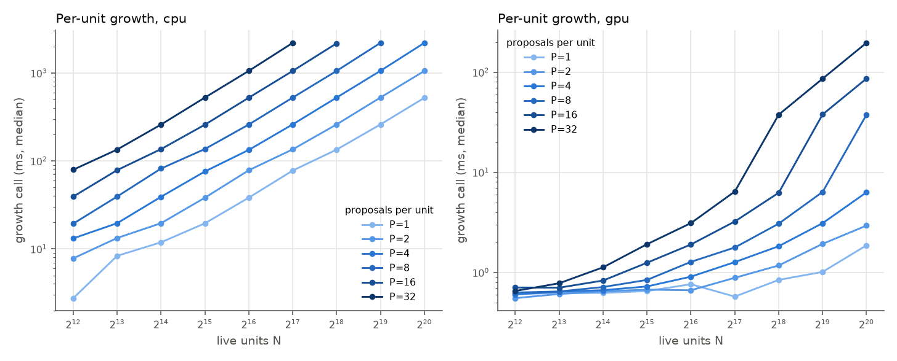
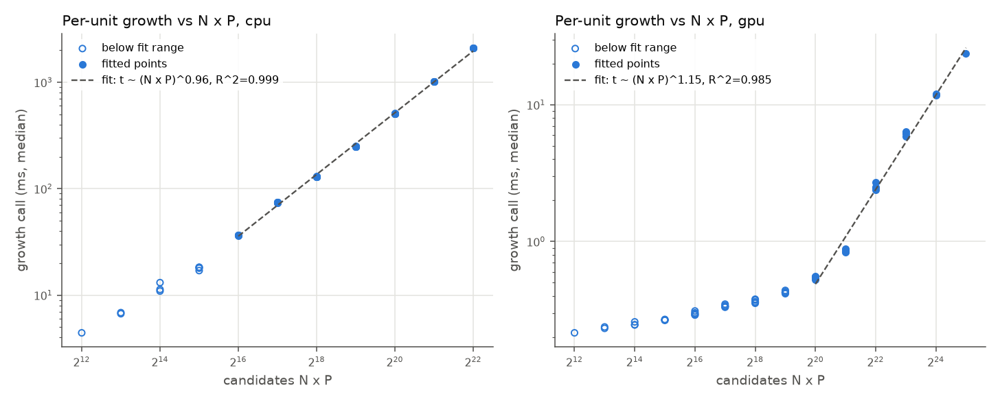
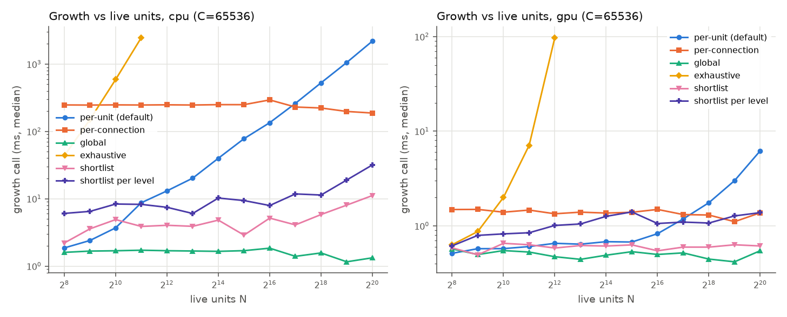
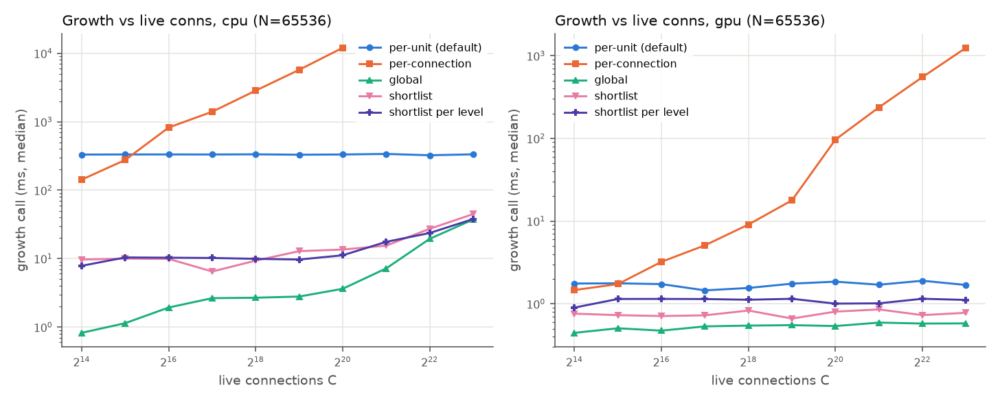
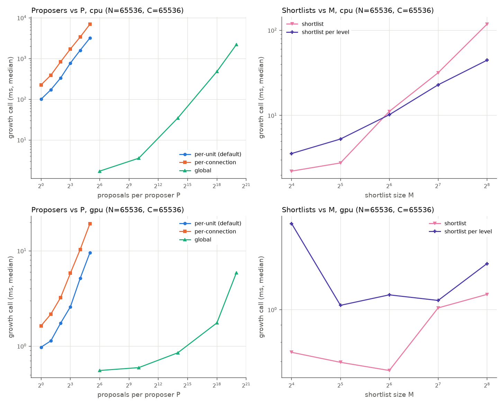
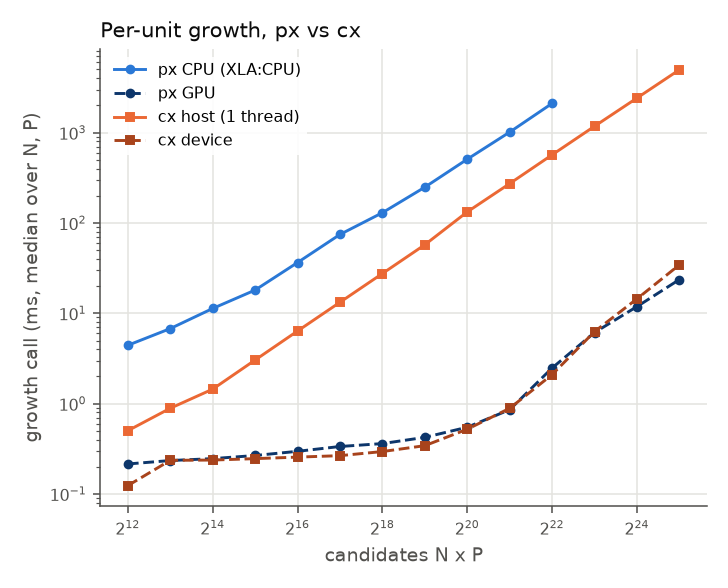
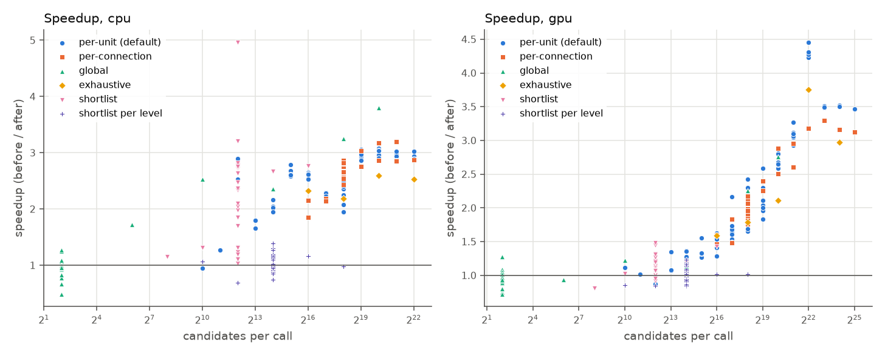

# Growth benchmarks

Time of one connection-growth phase (the add_conn phase that
`plastax.phases.build_add_conn_phase` builds) for every growth strategy,
against live units N, live connections C and proposals per proposer P, on
CPU and GPU. The setup mirrors plastax-cpp's growth bench
(`benchmarks/bench_growth.cpp` in that repository) point for point, so the
last section compares the two libraries directly.

The numbers below are steady-state times (20 warm-up calls) after two
changes (a later, smaller one, the packed (src, dst) sort key, has its own
section, "Packed (src, dst) key: before and after"):

- the GPU total-order sort, the per-level ranking and the slot claim were
  cut down (section "Radix total order and fewer claim kernels: before and
  after");
- earlier, the single-sort selection: each bucket's winners are taken from
  one total-order sort of the shared candidate list, instead of one full sort
  per bucket (section "Single-sort selection: before and after").

- Harness: `examples/benchmarks/growth_bench.py`.
- Driver: `examples/benchmarks/run_growth.sh`.
- Plots, fits and the cx comparison: `examples/benchmarks/plot_growth.py`.
- Raw data: `benchmarks/results/growth/`:
  - `growth_cpu.csv` and `growth_gpu.csv`, one row per point;
  - `growth_cpu_before.csv` and `growth_gpu_before.csv`, the same grid
    with the same harness, before the radix and claim changes;
  - `growth_before_after.csv`, every point of both runs, with the speedup;
  - `single_sort/`, the runs before and after the single-sort change, with
    their own `growth_before_after.csv` and plot;
  - `growth_fit.csv`, the per-unit fits;
  - `growth_vs_cx.csv`, every point both libraries ran, with the time ratio;
  - `device_clocks.csv`, the clock log of the GPU run.

## Setup

**Network.** Four levels of N/4 units each, built with
`NetworkBuilder.from_edges`. The C live connections are split evenly over the
three adjacent level pairs, with random endpoints (parallel edges allowed).
Levels are recomputed from the edges at build time, so a unit with no
incoming edge sits at level 0, as on the cx host. Each bucket gets 5 %
headroom, rounded up to a power of two (the `from_edges` default rounding).

**Rules.** Every rule uses `selection="top_k"` with `max_new_per_level = 16`
and `max_level_gap = 4`, which spans every level, so nearly every candidate
passes the window. The rules are:

- `per_unit`: `ProposeAddConn`, `proposer="per_unit"`, the default. Every
  unit proposes P edges into a random unit of the next built level, each with
  a random score drawn from the site's `Rng`.
- `per_connection`: `proposer="per_connection"`. Each connection's source
  proposes P edges in the same way.
- `global`: `proposer="global"`. P proposals from random sources.
- `exhaustive`: `ScoreAddConn` over every unit pair, with a hashed score.
- `shortlist`: `candidates="shortlist"`, with a hashed importance and
  `shortlist_size` M.
- `shortlist_level`: `candidates="shortlist_per_level"`, with a hashed
  importance and `shortlist_size` M.

Nothing is deduplicated (the default). A score rule's window also admits
backward and same-level pairs, so a scorer can fill the small bucket of the
last level. The `overflow` column records when a bucket ran out of free
slots. That drops commits but does not change the work of a call.

**Timing.** Each point jits the add_conn phase alone, with the state
donated as in a real step. The jitted function also advances the step
counter, so every call draws fresh proposals. It is compiled ahead of time
(`jit(...).lower(state).compile()`), and the compile time is reported
separately as `compile_s`. Then it runs 20 warm-up calls and reports the
median of 7 calls. Each call is timed with `time.perf_counter` around the
call and `jax.block_until_ready`, so GPU times include dispatch.

A GPU call needs about 15 calls in a fresh process to reach its steady-state
time (a host-side warm-up; see `gpu_gap_analysis.md`), so earlier runs, with
2 warm-up calls, overstated the GPU floor by up to 0.3 ms. The warm-up is cut
short after 10 s, which only the CPU points of a second or more per call
reach (21 of 191, after 3 to 19 calls). The `warmup` column records the
calls each point warmed up.

**Backends.**

- CPU: XLA:CPU on an i7-14700K (20 threads). Unlike the single-threaded cx
  host build, XLA uses every thread.
- GPU: an RTX 5000 Ada with `jax[cuda13]` 0.11.0 (the frozen lock). The SM
  clock was locked to 2505 MHz and the memory clock to 8551 MHz; every
  sample of the clock log taken under load reads 2505/8551, and no other
  process used the GPU during either GPU run. Slots are claimed with the
  XLA engine (`growth="xla"`); the Triton claim was not installed.

Both runs set `XLA_FLAGS=--xla_disable_hlo_passes=constant_folding`.

- With constant folding on, XLA folds the exhaustive candidate grid at
  compile time: 188 s to compile N = 4096 on the GPU.
- On CPU, a fusion feeding the slot claim also takes about 15 s of LLVM code
  generation per point at 32K-slot buckets.
- Disabling the pass leaves run times unchanged, checked at five points on
  each backend.

With the flag set, a point compiles in a median of 1.0 s on CPU (max 1.8 s)
and 2.1 s on the GPU (max 4.3 s).
The per-point compile times are plotted in `growth_compile.png`.

**Sweeps.** These are cx's sweeps. Each holds the parameters it does not
vary fixed at P = 4, M = 64, N = 65536 and C = 65536.

| sweep | varies | strategies |
|---|---|---|
| `np` | N = 2^12..2^20 x P = 1..32 | per_unit (the full grid) |
| `n` | N = 2^8..2^20 | all; exhaustive only up to N = 4096 (N^2 candidates) |
| `c` | C = 2^14..2^23 | all but exhaustive |
| `p` | P = 1..32 (per_unit, per_connection), P = 64..2^20 (global), M = 16..256 (shortlists) | all but exhaustive |

The largest network holds about 8.4M connections, far below the
300M-edge limit. The GPU run covers all 201 points.

The CPU run skips points with more than 2^22 candidates per call
(`--max-candidates`), where one call took 6 s or more before the
single-sort change. It covers 191 points in 18 minutes (the GPU run, 8 minutes). The 10 skipped
points are:

- `np`: the six points with N x P > 2^22;
- `n`: exhaustive at N = 4096;
- `c`: per_connection at C = 2^21..2^23.

Reproduce from the repository root (the GPU venv as in
`docs/development/tooling.md`):

```bash
UV_PROJECT_ENVIRONMENT=.venv-gpu uv sync --extra cuda13
examples/benchmarks/run_growth.sh .venv/bin/python .venv-gpu/bin/python   # add --quick for a smoke run
```

## Per-unit growth scales as N x P





The fit is a least-squares fit of log t against log(N x P) over the `np`
grid. It starts above the fixed-cost floor. A second model fits
log t = a + alpha log N + beta log P on the same points.

| backend | fit range (N x P) | points | slope in N x P | R^2 | alpha (N) | beta (P) | time per candidate |
|---|---|---|---|---|---|---|---|
| CPU | >= 2^16 | 38 | **0.96** | 0.999 | 0.96 | 0.97 | 0.49 us |
| GPU | >= 2^20 | 21 | **1.15** | 0.985 | 1.15 | 1.14 | 0.53 ns |
| GPU | >= 2^23 | 6 | **0.97** | 0.997 | 0.98 | 0.96 | 0.71 ns |

- **CPU.** Per-unit growth is linear in N x P: the slope is 0.96, and alpha
  equals beta, so the time depends on the product alone. Points with equal
  N x P coincide; for example, every point with N x P = 2^16 takes 36 to
  37 ms,
  from N = 4096 with P = 16 to N = 65536 with P = 1.
- **GPU.** The GPU also collapses onto N x P (alpha = beta).
  - Up to about 2^16 candidates a call sits at a floor of 0.22 to 0.31 ms;
    at 2^18 (N = 65536, P = 4) it takes 0.35 to 0.38 ms, and at 2^20 0.53
    to 0.56 ms.
  - Between 2M and 8M candidates the time rises faster: 0.83 to 0.88 ms at
    2M, 2.4 to 2.7 ms at 4M and 5.8 to 6.4 ms at 8M, as the radix sort's
    buffers outgrow the 64 MB L2 (cx's device cliff is at the same N x P).
    The step is far gentler than with the earlier merge-network sort
    (6.3 ms to 38 ms between 4M and 8M). Near this point a call varies by
    about 20 % from run to run (the probe's 4M point: 2.4 to 2.7 ms
    synced around 2.0 ms of device time).
  - Past 8M the slope is 0.97 (linear), against cx's 1.23.
- **Speedup.** At 4M candidates the GPU takes 2.7 ms against 2.1 s on CPU,
  about 780x.
- **Cost driver.** The selection's one sort of the N x P candidates on
  (-score, src, dst, index). On CPU it is about 94 % of a call (see the
  profile below). On the GPU, above 2^17 candidates, it runs as three
  stable radix passes.

## Strategies vs live units, live connections and P







All times are the median growth-call time in ms.

| strategy | cost driver | CPU (N=C=65536) | GPU (N=C=65536) |
|---|---|---|---|
| per_unit, P=4 | N x P; flat in C | 129 | 0.36 |
| per_connection, P=4 | conn capacity x P (C log C) | 287 | 0.68 |
| global, P=4 | P, plus the slot claim over every bucket (grows with C on CPU) | 0.59 | 0.21 |
| exhaustive, N=2048 (CPU) / 4096 (GPU) | N^2 | 2385 | 16.0 |
| shortlist, M=64 | N ranking + M^2 | 4.9 | 0.28 |
| shortlist_level, M=64 | levels x (N ranking + M^2) | 6.5 | 0.74 |

### Per-connection

- Linear in C on both backends. On CPU it goes from 59 ms at C = 2^14 to
  4.0 s at C = 2^20, about 2x per doubling. On the GPU it goes from 0.6 ms
  at C = 2^14 to 125 ms at C = 2^23.
- On the GPU the time rises faster from C = 2^19 (3.4 ms) to 2^20 (7.7 ms)
  and 2^21 (16.5 ms). The per-connection pool is the conn capacity times P,
  so this falls at the same 4M to 8M candidates as the per-unit rise.
- The pool counts dead slots too: per_connection proposes from every slot of
  the arena, live or not, and vetoes the dead ones.

### Shortlists

- Flat in N up to about 2^18 on CPU and over the whole range on the GPU
  (0.22 to 0.32 ms for shortlist; 0.39 to 1.17 ms for shortlist_level,
  which grows slowly with N).
- Flat in C until the slot claim over the larger buckets shows on CPU,
  reaching 17 to 18 ms at C = 2^23.
- Growing in M on CPU (the M^2 grid: 40 ms for shortlist and 44 ms for
  shortlist_level at M = 256), and nearly flat in M on the GPU (0.25 to
  2.0 ms).
- shortlist_level draws a separate M x M grid per bucket, so it still sorts
  once per bucket; its times are unchanged by the single-sort change.
- On CPU the shortlist points vary up to 2x from run to run (one call is 3
  to 12 ms, spread over XLA:CPU's thread pool), so single points compare
  poorly between runs.

### Exhaustive

Exhaustive is N^2. At N = 2048 it takes 2.4 s on CPU. At N = 4096 it takes
16 ms on the GPU.

### Global

- Global costs only P plus a floor, the slot claim over every bucket.
- On CPU the claim's reads of the dead masks show: the floor grows with the
  conn capacity, from 0.28 ms at C = 2^14 to 1.5 ms at C = 2^20 and 12 ms
  at C = 2^23.
- On the GPU the floor is flat at 0.18 to 0.27 ms at every C and up to
  P = 1024, and P = 2^20 takes 0.66 ms.

### Per-unit (the default)

The per-unit default is flat in live connections:

- CPU: 129 to 131 ms from C = 2^14 to C = 2^21, rising to 143 ms at
  C = 2^23 as the slot claim over the larger buckets shows;
- GPU: 0.36 to 0.43 ms over the whole range.

Its cost tracks N x P alone.

## Comparison with plastax-cpp



`growth_vs_cx.csv` matches every point that both libraries ran: 392 points.
px CPU is matched against the cx host, and px GPU against the cx device. A
ratio above 1 means px is slower. The cx rows are plastax-cpp's current
results, including its rerun of the host per-connection sweeps (its host
proposer is now C log C, and runs to C = 2^20 here, and its device
per_connection and shortlist reruns).

| strategy | point | px CPU | cx host | ratio | px GPU | cx device | ratio |
|---|---|---|---|---|---|---|---|
| per_unit | N=65536, P=4 | 129 | 27.3 | 4.7 | 0.36 | 0.29 | 1.23 |
| per_unit | N x P = 2^20 (N=2^18, P=4) | 508 | 133 | 3.8 | 0.55 | 0.53 | 1.04 |
| per_unit | N x P = 2^22 (N=2^20, P=4) | 2106 | 581 | 3.6 | 2.70 | 2.13 | 1.27 |
| per_unit | N x P = 2^25 (N=2^20, P=32) | skipped | | | 23.6 | 34.4 | **0.69** |
| per_connection | C=2^14, P=4 | 58.9 | 9.18 | 6.4 | 0.59 | 0.35 | 1.71 |
| per_connection | C=2^16, P=4 | 287 | 41.1 | 7.0 | 0.68 | 0.39 | 1.72 |
| per_connection | C=2^20, P=4 | 4041 | 929 | 4.4 | 7.65 | 2.60 | 2.9 |
| per_connection | C=2^23, P=4 | skipped | not run | | 125 | 46.3 | 2.7 |
| global | P=4 | 0.59 | 0.0005 | ~1100 | 0.21 | 0.12 | 1.69 |
| global | P=2^20 | 573 | 170 | 3.4 | 0.66 | 0.58 | 1.15 |
| exhaustive | N=2048 | 2385 | 632 | 3.8 | 3.32 | 2.09 | 1.59 |
| exhaustive | N=4096 | skipped | | | 16.0 | 15.8 | 1.01 |
| shortlist | M=64 | 4.9 | 22.5 | **0.22** | 0.28 | 0.18 | 1.59 |
| shortlist_level | M=64 | 6.5 | 104 | **0.06** | 0.74 | 0.34 | 2.2 |

All times are in ms. Over all matched points, the median ratio is 4.7 on
CPU and 1.5 on the GPU (4.9 and 2.3 in the previous run; 11.8 and 3.2
before the single-sort change).

- **Per-unit, global and exhaustive.** On CPU cx is about 4x faster above
  the px floors. On the GPU px per-unit is 1.1 to 1.3x cx's time up to 1M
  candidates, level with it (0.93 to 1.27x, within the run-to-run spread)
  from 1M to 8M, and faster beyond: 0.8x at 16M and 0.69x at 32M.
  Exhaustive is 1.0 to 1.6x, global at P = 2^20 1.15x, and global at small
  P 1.5 to 1.8x (the floors, below).
  - Both libraries scale the same way on CPU (per-unit slope about 1.0,
    alpha = beta); on the GPU px's slope past 8M candidates (0.97) is now
    below cx's (1.23).
  - On CPU, what is left is px's one full sort of the candidate list on
    (-score, src, dst, index), where cx does not sort the whole list.
    On XLA:CPU that sort costs about 0.43 us per candidate (see the profile
    below); XLA:CPU has no radix path for it. XLA:CPU uses 20 threads
    against cx's one and is still about 4x slower.
- **Per-connection.** Both libraries are C log C on CPU, and px is 4.4 to
  7x slower there. On the GPU px is 1.5 to 1.8x slower than cx's current
  device results up to C = 2^18, and 2.1 to 3.1x from C = 2^20.
- **Shortlists.** On CPU px is faster than cx (4.6x and 16x at M = 64),
  because cx ranks units and enumerates the pairs on the host. cx's current
  device results rank on the device, and there px is 1.6x (shortlist) and
  2.2x (shortlist_level) slower at M = 64.
- **Floors.** The px GPU floor is 0.18 to 0.27 ms per call, against 0.12 to
  0.18 ms for cx. px pays a host dispatch, which `perf_counter` includes
  and CUDA events do not (the CUDA-graph launch and its completion
  callback, about 0.1 ms; see `gpu_gap_analysis.md`). On CPU, global's px
  floor (about 0.5 ms) is the slot claim over every bucket, where cx's host
  loop touches only the few commits.

## Packed (src, dst) key: before and after

**What changed.** When the unit capacity is at most 65536
(`PACKED_ID_BOUND`, known at trace time), every candidate's source and
destination fit in 16 bits, so `radix_total_order` merges the dst and src
passes into one stable radix sort on the uint32 key `(src << 16) | dst`,
followed by the -score pass: two CUB sorts instead of three, with the same
permutation. Larger capacities keep the three passes (a 64-bit packed key
costs about as much as two 32-bit passes). The tables in the sections above
predate this change.

**Equivalence.** `tests/test_total_order.py` checks the packed form against
the comparison sort, the three-pass form and the lexsort oracle on the same
adversarial lists (NaN of either sign, +-inf, +-0.0, subnormals, heavy
ties), plus lists over the full 16-bit id range that always contain the ids
at the key's carry boundaries (0, 1, 255, 256, 32767, 32768, 65279, 65280,
65534, 65535) and every pair of them, on CPU and on the GPU. On the GPU the
growth goldens, the claim digests and the growth stage tests pass with the
radix threshold forced to 0. In the interleaved run below, both forms end in
bit-identical states after about 220 calls at every point.

**Isolated sort** (GPU, locked clocks, ids uniform in [0, 65536), median of
51 synced calls; pipelined is the mean of 200 back-to-back calls):

| candidates | three passes (ms) | packed (ms) | speedup synced / pipelined |
|---|---|---|---|
| 2^17 | 0.188 | 0.146 | 1.29x / 1.39x |
| 2^18 | 0.204 | 0.162 | 1.26x / 1.35x |
| 2^20 | 0.345 | 0.275 | 1.26x / 1.30x |
| 2^22 | 2.07 | 1.73 | 1.20x / 1.23x |
| 2^24 | 15.1 | 10.9 | 1.38x / 1.41x |
| 2^25 | 35.8 | 23.8 | 1.51x / 1.60x |

**Growth phase, per_unit** (the points with N <= 65536 and at least 2^17
candidates; the others do not change). The bench's 7-rep floor points
jitter by up to 0.1 ms between runs, more than the change, so these come
from one process that compiles the phase both ways and alternates 8 blocks
of 25 synced calls each (median, locked clocks):

| point | three passes (ms) | packed (ms) | speedup |
|---|---|---|---|
| N=65536, P=2 (131K) | 0.345 | 0.302 | 1.14x |
| N=65536, P=4 (262K) | 0.364 | 0.319 | 1.14x |
| N=65536, P=8 (524K) | 0.416 | 0.363 | 1.15x |
| N=65536, P=16 (1M) | 0.530 | 0.455 | 1.17x |
| N=65536, P=32 (2M) | 0.834 | 0.719 | 1.16x |
| N=32768, P=32 (1M) | 0.533 | 0.457 | 1.17x |
| N=4096, P=32 (131K) | 0.347 | 0.303 | 1.14x |

Every other affected point (N = 8192 to 32768) gains 1.10 to 1.17x, about
0.04 to 0.08 ms, the cost of one radix sort.

## Radix total order and fewer claim kernels: before and after


**What changed.** Three changes to the add_conn phase, none of which changes
a result:

- **Total order on the GPU.** XLA cannot send a multi-key sort to CUB, so
  the four-key `lax.sort` on (-score, src, dst, index) ran as XLA's own
  merge network: 36 kernels at 262K candidates, 120 at 32M, and an
  O(n log^2 n) cost that fell off the L2 at 4M candidates. On a GPU, from
  `RADIX_TOTAL_ORDER_MIN` = 2^17 candidates, `total_order` now takes three
  stable one-key sorts (dst, then src, then -score; the index is implicit
  through stability), which XLA lowers to CUB onesweep radix sorts. -0.0 is
  folded to +0.0 first, since the comparator ties the two zeros. Below
  2^17 candidates and on CPU the four-key sort stays: in isolation it beats
  the three radix launches up to 2^17 (0.145 against 0.148 ms there; the
  merge network pads to the next power of two, so at 147456 candidates it
  takes 0.175 against 0.151 ms), and XLA:CPU has no radix path.
- **Per-level ranking.** `select_per_segment` ranks a chunk of levels with
  one running count over a (candidates x levels) one-hot and one scatter,
  instead of a cumsum and a scatter per level. The one-hot is capped at
  2^22 elements: on a longer list a pass per level moves the same bytes
  faster, and the saved launches no longer matter.
- **Slot claim.** On the GPU, `xla_claim_buckets` claims every bucket at
  once: the ranks, the cross-shard counts and the free-slot search are
  shared, leaving the per-bucket block counts and column scatters. On both
  backends `grown` is now the committed count rather than two live counts
  over every dead mask, which also removes a copy of each dead mask. CPU
  keeps the per-bucket claim, which XLA:CPU overlaps with the other
  buckets' selection.

Kernels per call (nsys, `--cuda-graph-trace=node`):

| point | before | radix sort | + ranking | + claim |
|---|---|---|---|---|
| per_unit N=65536, P=4 (262K) | 123 | 108 | 101 | 72 |
| per_unit N=2^18, P=4 (1M) | 145 | | | 77 |
| global P=4 | 65 | | | 44 |

The memcpys per call fall from 14 to 7 (per_unit) and 12 to 8 (global).
The 16 column scatters (4 buckets x 4 columns) remain: XLA's scatter is
one array per kernel, and a variadic scatter lowers to a loop on the GPU.

**Equivalence.**

- `tests/test_total_order.py` compares both sort formulations, called
  directly, with a lexsort oracle on randomized lists with NaN of either
  sign, +-inf, +-0.0, subnormals and heavy ties, on CPU and on the GPU.
- On the GPU, the growth goldens, the pinned claim digests and the growth
  stage tests give the same outcomes with the radix threshold forced to 0
  and to infinity.
- `select_per_segment` and the multi-bucket claim are checked against the
  per-level and per-bucket forms (`tests/test_growth_stages.py`,
  `tests/test_growth_claim.py`).
- `gpu_gap_probe.py`'s digest (every connection column of every bucket,
  after about 100 calls) matches the previous code at 11 points from 4 to
  33M candidates, with either sort forced.
- Across the two bench runs, every point grows the same number of edges
  and raises the same overflow flag.

**Speedup.** Both runs use the steady-state harness (20 warm-up calls), on
the same machine and clocks; `growth_cpu_before.csv` and
`growth_gpu_before.csv` hold the previous code.

| strategy | GPU median speedup | at N = C = 65536 (GPU) | largest point (GPU) |
|---|---|---|---|
| per_unit | 1.56x | 0.565 -> 0.358 ms | N=2^20, P=32: 197 -> 23.6 ms (8.3x) |
| per_connection | 1.90x | 1.40 -> 0.68 ms | C=2^23: 403 -> 125 ms (3.2x) |
| exhaustive | 2.18x | N = 2048: 7.2 -> 3.3 ms | N=4096: 97.5 -> 16.0 ms (6.1x) |
| global | 1.14x | 0.256 -> 0.205 ms | P=2^20: 2.47 -> 0.66 ms (3.7x) |
| shortlist | 1.18x | 0.34 -> 0.28 ms | |
| shortlist_level | 1.05x | 0.77 -> 0.74 ms | |

- The GPU speedup grows with the candidates, from the 2^17 threshold up:
  per-unit takes 2.4x less at 4M candidates and 6.2 to 8.3x less from 8M,
  where the merge network fell off the L2.
- The bench's floor points jitter by up to 0.1 ms between neighbouring
  points (host time in the graph launch). The probe, with 30 warm-up and
  31 timed calls at locked clocks, gives 0.240 -> 0.193 ms synced and
  0.110 -> 0.083 ms pipelined for global P=4, and 0.557 -> 0.359 ms synced
  for per_unit at 262K.
- On CPU only the claim changed (and the per-level ranking, which moves
  the same bytes there). global P=4 is 2.3x faster (median; 1.4 to 0.60 ms
  at C = 65536 and 36.9 to 12.4 ms at C = 2^23), since it no longer reduces
  every dead mask twice. per_unit, per_connection and exhaustive are 3 to
  4 % faster (median). The shortlist points vary up to 2x between runs on
  CPU; alternating fresh-process runs of shortlist_level (M = 64) give
  5.9 to 10.9 ms before and 7.2 to 10.0 ms after.

## Single-sort selection: before and after

These numbers are from the runs published with that change (2 warm-up
calls, `jax[cuda13]` 0.11.2), kept in `results/growth/single_sort/`.



**Profile.** Profiled on CPU at the per-unit point N = C = 65536, P = 4
(262144 candidates, four buckets) by timing the jitted phase with stages
replaced:

| variant | ms per call |
|---|---|
| before: one 4-key sort of the whole list per bucket | 337 |
| before, with the selection sort replaced by `lax.top_k` | 7.2 |
| one 4-key `lax.sort` of 262144 candidates, alone | 114 |
| after: one sort per call | 138 |
| after, with the sort stubbed out | 8.4 |

Before the change, the four per-bucket sorts were about 98 % of the call
(about 84 ms each), so the cx gap came mostly from them. The proposals, the
validity masks and the slot claim together cost about 7 ms. After the
change the one sort is still about 94 % of the call.

**Design.** Every strategy but `shortlist_per_level` draws all buckets from
one shared candidate list. A topological bucket only admits candidates
sourced at its own level, so the buckets' valid sets partition that list by
source level, and every other bucket scores a candidate -inf. The phase now
merges the per-bucket validity masks into one, scores the list once, runs
the within-step dedupe once (a pair's copies share a source, so a bucket),
and sorts it once into the total order (`total_order`). Each bucket's
winners are its own source level's members in that order, ranked by a
running count of them (`select_per_segment`). Restricted to one bucket, that
is the same order a per-bucket sort produces ahead of its first -inf
candidate, so the committed edges, their order, the overflow and resort
flags and every column are bit-identical. `shortlist_per_level` still
selects per bucket, since each bucket has its own grid.

**Equivalence.** `tests/test_growth_single_sort.py` keeps the per-bucket
formulation as a test-only reference and checks both against each other bit
for bit over 36 randomized layered nets. These cover every candidate source
and selection mode, the step cap, both dedupes, the window knobs, unit
capacities, PIPELINE, NaN and -inf scores, and buckets tight enough to
overflow. The reference also matches the previous phase exactly. The
growth goldens and the pinned claim digests pass unchanged. Across the two
bench runs, every point grows the same number of edges and raises the same
overflow flag.

**Speedup.** `single_sort/growth_before_after.csv` holds every point of both runs. The
GPU "before" run is a rerun of the previous code in the same environment as
the "after" run (it matches the earlier published GPU run to a median ratio
of 1.00). The CPU "before" run is the earlier published one.

| strategy | CPU median speedup | GPU median speedup | at N = C = 65536 (CPU / GPU) |
|---|---|---|---|
| per_unit | 2.6x | 2.0x | 334 -> 134 ms / 1.67 -> 0.91 ms |
| per_connection | 2.8x | 2.1x | 826 -> 294 ms / 3.25 -> 1.49 ms |
| exhaustive | 2.4x | 2.1x | N = 2048: 6272 -> 2477 ms / 26.7 -> 7.1 ms |
| shortlist | 2.2x | 1.1x | 10.6 -> 5.2 ms / 0.81 -> 0.54 ms |
| global | 1.0x | 1.0x | 1.75 -> 1.84 ms / 0.51 -> 0.50 ms |
| shortlist_level | 1.0x | 1.0x | unchanged (per-bucket grids) |

- The speedup grows with the candidates, toward the bucket count (4x).
  Per-unit reaches 3.0x on CPU and 4.3x on the GPU (at 4M candidates on the
  GPU, 27.2 ms to 6.3 ms).
- global at small P is the slot-claim floor, which the change does not
  touch; its large-P points speed up like per-unit (3.8x on CPU and 2.8x
  on the GPU at P = 2^20).
