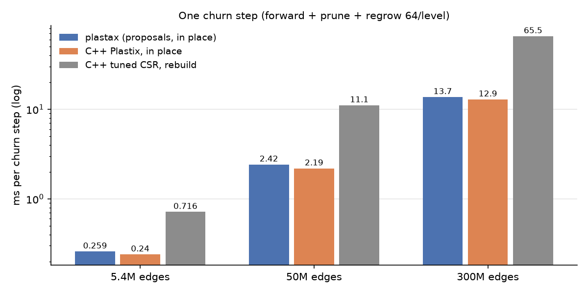
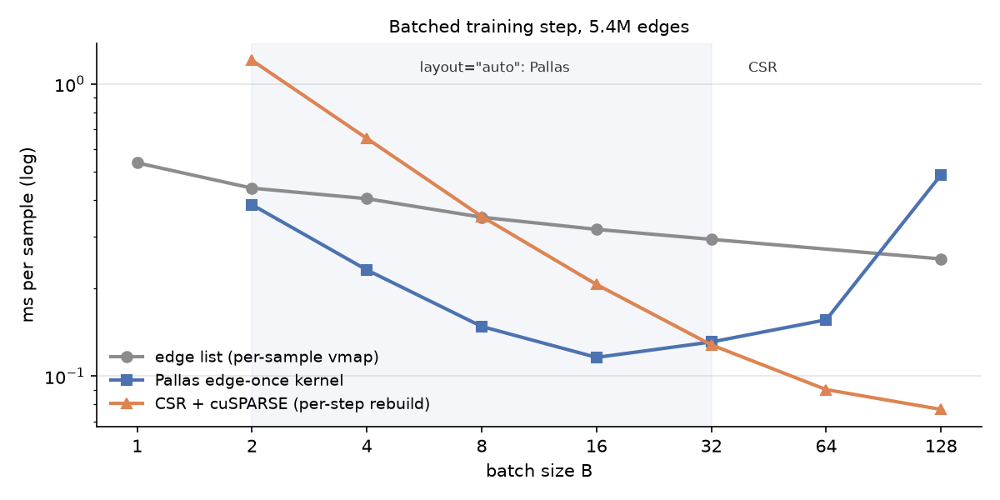
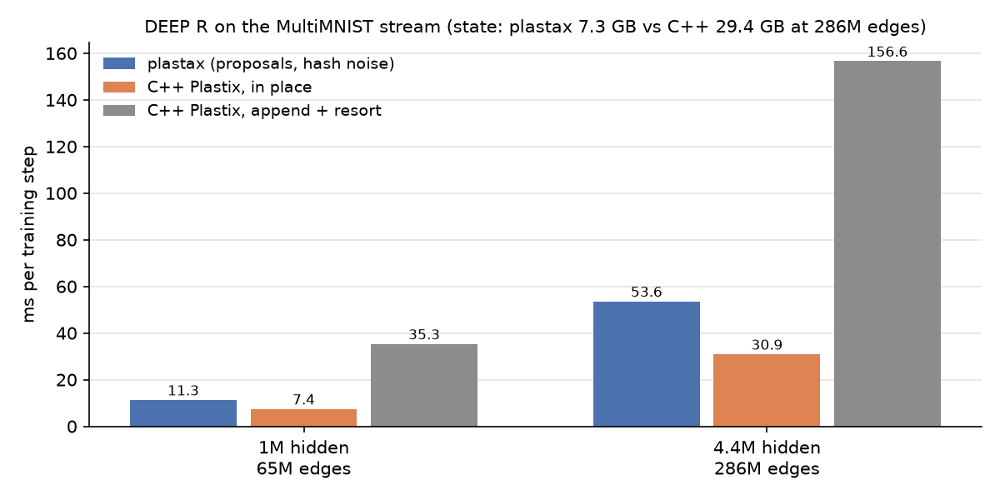

# plastax at scale: results (branch `scale`)

2026-10-01 · cdol01, RTX 5000 Ada (32 GB), jax 0.11.2 + `jax[cuda13]`. C++
numbers come from plastix-synth-bench (`REEVAL_RESULTS.md`) and from
`main_deepr.cpp` on the same machine. The plan, decisions and loop log are in
[`SCALE_PLAN.md`](../../SCALE_PLAN.md). Figures are regenerated by
`examples/benchmarks/plot_scale_results.py` and `plot_step_300M.py`.

## Headline

> **Correction (2026-10-01, after wiring plastax into plastix-synth-bench).**
> The churn-step comparison below used `churn_probe.py`, which churns 64
> *edges* per level per step, about 128 edges. The C++ numbers it was set
> against churn 64 *units* per update, which is about 20K edges pruned and
> regrown.
>
> On the benchmark's own workload (`impl/plastax/run.py`, same topology and
> churn files, post-churn validation passing on every cell), plastax is
> **1.3-1.6× slower than C++ in place from 50M to 300M edges**, and
> **2.3-3.2× slower at 5.4M**, where per-step fixed costs dominate:

| edges | C++ in place | plastax | ratio | C++ peak | plastax single-state peak |
|---|---|---|---|---|---|
| 5.4M (s=0.99) | 0.159 ms | 0.508 ms | 3.2× | 1.13 GB | ~0.15 GB |
| 50M (s=0.999) | 2.157 ms | 2.972 ms | 1.4× | 5.08 GB | ~1.2 GB |
| 300M (s=0.9999) | 12.85 ms | 16.68 ms | 1.3× | 27.3 GB | ~4.7 GB |

> See plastix-synth-bench `docs/PLASTAX_GRID.md` for all 11 cells. The
> "within 6-10%" figure is retracted.
>
> The bullets below hold for the light-churn probe workload only.

- On the light-churn probe, plastax's churn step is within 6-10% of C++ from
  5.4M to 300M edges.
- **Memory:** about 13 B of state per slot against about 91 B for C++, so
  plastax holds 300M edges in about 4.7 GB at peak, against 27 GB for C++.
  The arithmetic is the same: fp32 weights and int32 ids.
- **It started 11× behind:** 144 ms at 300M before this branch, against
  13.7 ms now on the light-churn probe.
- **Batched training:** `layout="auto"` picks a Pallas edge-once kernel for
  2 ≤ B ≤ 32 and CSR + cuSPARSE above. At 5.4M edges that is up to 3.3× per
  sample over the per-sample edge list.
- **DEEP R on the real MultiMNIST stream runs at 286M edges** (4.4M hidden
  units) in 7.3 GB, against 29.4 GB for C++. It is 1.7× behind C++ in place
  and 2.9× ahead of append + resort.

## One churn step

| edges | plastax | C++ in place | C++ tuned CSR | plastax state |
|---|---|---|---|---|
| 5.4M | 0.259 ms | 0.24 ms | 0.716 ms | 0.07 GB |
| 50M | 2.42 ms | 2.19 ms | 11.1 ms | 0.69 GB |
| 300M | 13.7 ms | 12.9 ms | 65.5 ms | 4.10 GB |

Measurement setup:

- Probe: `churn_probe.py --grow propose --align 256` at `407ccb1`. Two source
  levels, 64 edges churned per level per step, and 5% capacity headroom.
- The forward (7.6 ms at 300M) and prune (6.0 ms) are at the DRAM roofline:
  13 and 10 B per slot, at about 520 GB/s.

| change | 300M step | what it fixed |
|---|---|---|
| start (`a145691`, grid growth) | 144 ms | — |
| proposal growth (`b2eb326`) | ~66 ms | the full-bucket sort for dedupe every step |
| source-major buckets (`d720ece`) | 27.9 ms | scatter-add serialised on atomics into one destination |
| aligned capacities (`9550d59`) | 18.3 ms | power-of-two padding (537M slots for 300M edges) |
| two-level free-slot search (`e901255`) | 14.0 ms | a capacity-sized cumsum per step |
| unrolled binary searches (`407ccb1`) | 13.7 ms | a kernel launch per halving step (0.53 → 0.26 ms at 5.4M) |

## Batched training

These are SGD steps (forward, loss, backward, update) on a 3-layer net with
5.4M edges.

- **Edge list.** The per-sample vmap touches every edge once per sample, so
  batching barely helps: 0.54 → 0.25 ms per sample from B = 1 to 128.
- **Pallas.** Each edge is read once for the whole batch. It is best for
  2 ≤ B ≤ 32: 2.4× the edge list at B = 8. Past B = 64 the E·B atomics
  dominate.
- **CSR.** It rebuilds the view on device every step (one radix sort) and
  multiplies with cuSPARSE. It is best above 32: 3.3× at B = 128. At 50M edges
  the per-step sort makes Pallas the better choice even at B = 32 (2.35
  against 3.16 ms per sample).
- **Exactness.** All five `plastax.optim` bundles match optax on the
  batch-mean loss, using the exact `per_sample` / `incoming_batched` path.

## DEEP R, real MultiMNIST stream

| hidden | edges | plastax | C++ in place | C++ append+resort | acc @ 300 (plastax / C++) |
|---|---|---|---|---|---|
| 1M | 65M | 11.3 ms\* | 7.4 ms | 35.3 ms | 0.43 / – |
| 4.4M | 286M | 53.6 ms | 30.9 ms | 156.6 ms | 0.40 / 0.465 |

The plastax runs use `deepr_scale.py --hash-noise` (in plastix-bench, an
untracked file).

\* The 1M plastax figure is the step alone. The 4.4M figure is the training
loop, which includes a per-step host read-back of the predictions.

At 1M hidden the step breaks down as:

- forward + loss + backward: 3.1 ms;
- the Langevin update: +5.4 ms (+7.4 with the port's threefry noise);
- prune: +2.4 ms;
- growth: +0.3 ms.

## Correctness work found along the way

- **The growth phase's duplicate check overflowed int32** past 46,340 units
  (`8abf3a5`).
- **A violated `indices_are_sorted` hint** on the forward sweeps (`2003ff5`).
- **The num_units² candidate grid was materialised eagerly** for every growth
  policy (`d5bc16b`).
  - This explains the "failed allocation of 4.9 TiB" log lines, which I had
    first misread as XLA autotuner noise.
- **Resort dropped the build headroom** (`9550d59`).
- **The CSR products were not all-reduced** under Scheme-A (`d768791`).
- **In the plastix-bench DeepR port** (not this repo): the Langevin noise key
  has the same int32 pair-id overflow.
